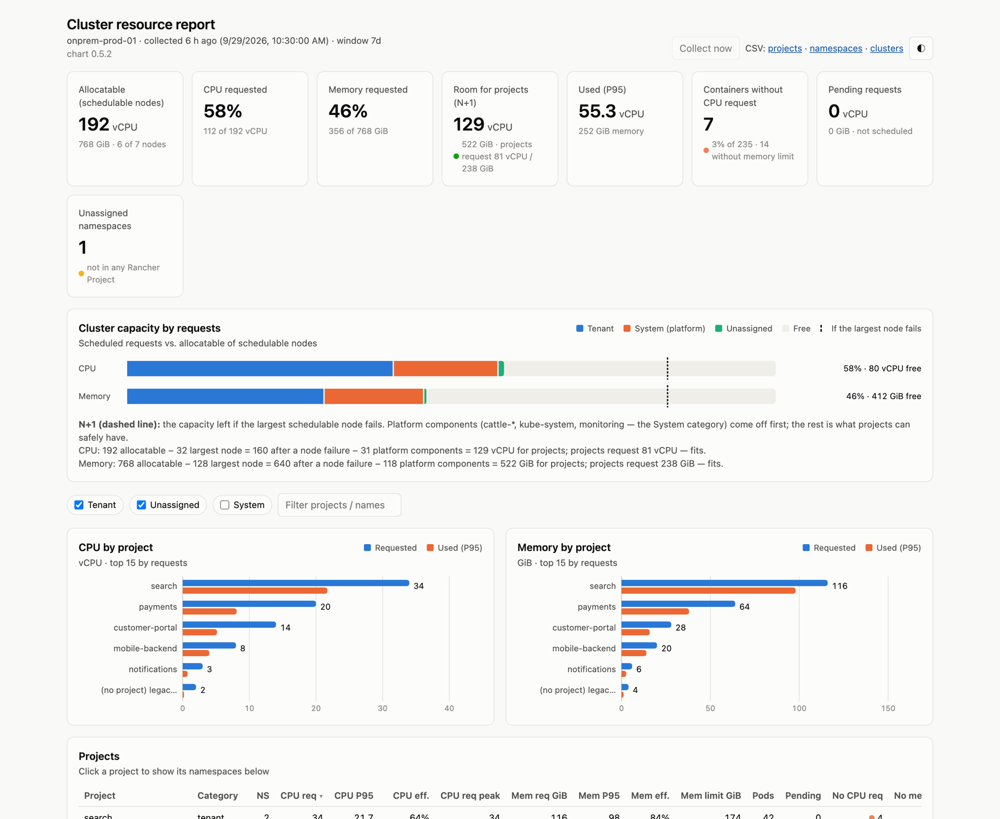
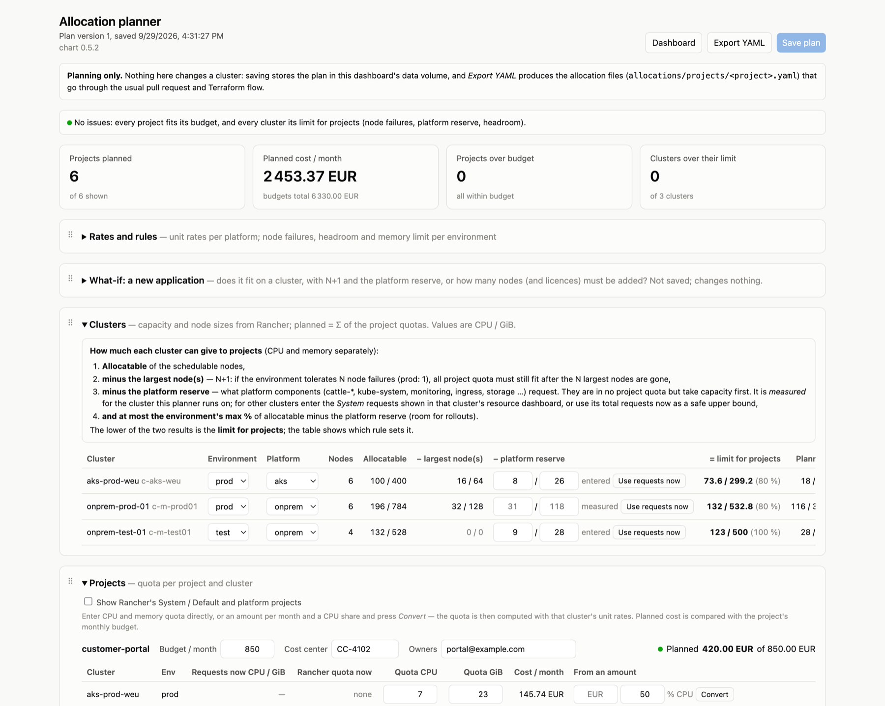
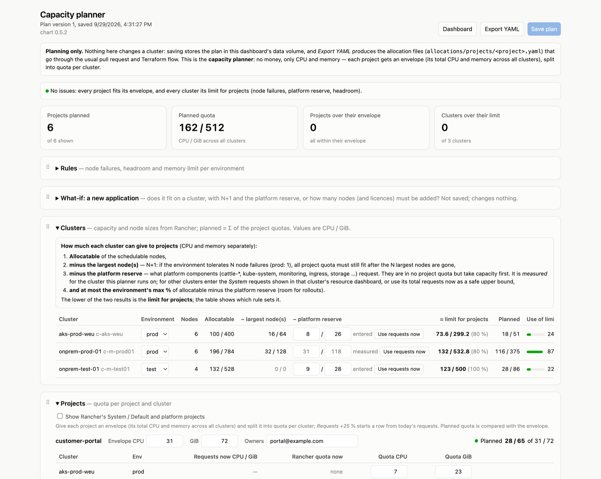
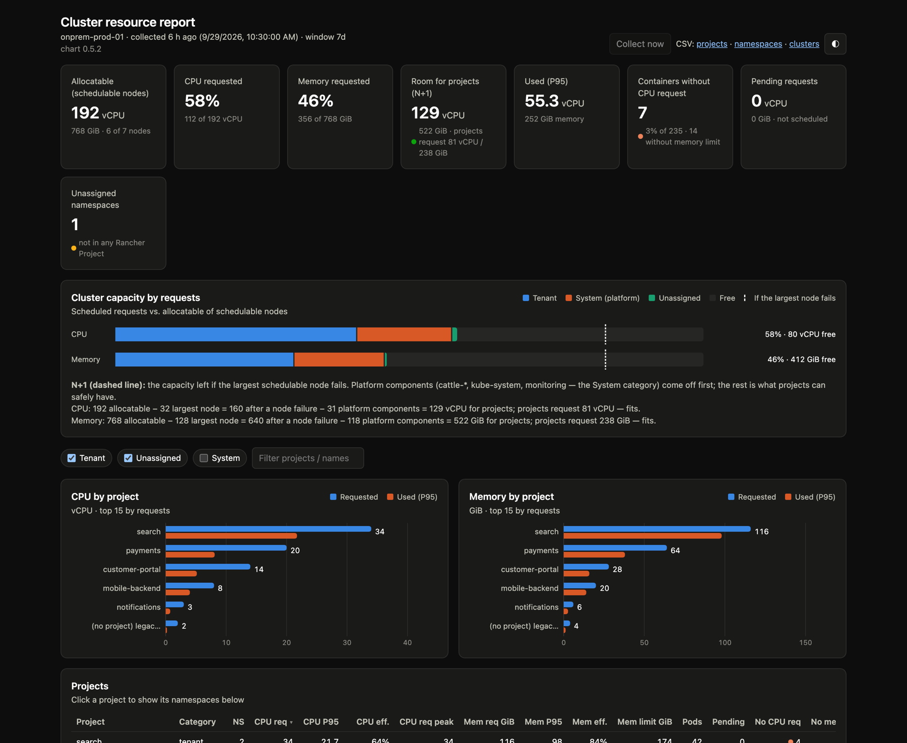
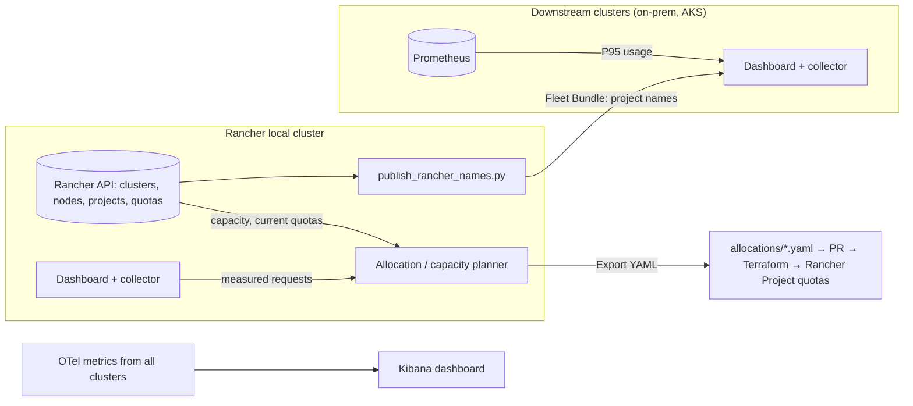

# cluster-resource-allocation

**Allocate Kubernetes capacity to teams by budget: see what every Rancher Project requests and uses, then plan
fair quotas that fit the cluster and the budget.**

[](https://github.com/cdalar/cluster-resource-allocation/tags)
[](https://github.com/cdalar/cluster-resource-allocation/actions/workflows/image.yml)
[](charts/cluster-resource-report/README.md)


This repository holds the design, the process and the tooling for allocating requests, limits and quotas to
projects (streams) based on their budgets. It targets on-prem clusters managed by Rancher (one Rancher Project
per stream, several namespaces each) and AKS clusters.



<sub>Screenshots use synthetic demo data.</sub>

## What you get

| | |
|---|---|
| 📊 **Resource dashboard** | Installed on every cluster. Shows requests, limits and P95 usage per cluster, Rancher Project and namespace. Also shows the room left for projects if the largest node fails (N+1), and containers that break the resource standards. CSV export. |
| 🧮 **Allocation planner** | Runs on the Rancher local cluster. For each project you set a monthly budget and a CPU and memory quota per cluster. The planner prices the quotas with unit rates and checks them against the budget and each cluster's limit for projects. It also has a what-if calculator for new applications. |
| 📦 **Capacity planner** | The same planner without money. Each project gets a CPU and memory envelope, which you split into a quota per cluster. |
| 📈 **Kibana dashboard** | The same as-is view in a central Kibana, built from the clusters' OpenTelemetry metrics. |
| 📐 **Design & process** | Resource standards, the allocation model (budget → quota), technical design, process (RACI), rollout and ADRs. |

**Read-only by design.** The tools never change workloads, quotas or Rancher objects. Plans are exported as
YAML allocation files, which go through a pull request and Terraform. The only writes are each planner's own
plan ConfigMap and one Fleet Bundle that publishes Rancher Project names to the downstream clusters.

## Screenshots

<table>
<tr>
<td width="50%"><a href="docs/images/planner.png"></a><br>
<b>Allocation planner</b>: the budget, planned cost and each cluster's limit for projects (allocatable − N largest nodes − platform reserve, capped by the headroom percentage).</td>
<td width="50%"><a href="docs/images/capacity.png"></a><br>
<b>Capacity planner</b>: the same cluster checks, with CPU and memory envelopes per project instead of money.</td>
</tr>
<tr>
<td colspan="2"><a href="docs/images/dashboard-dark.png"></a><br>
<b>Dark mode</b>: the dashboard follows the system theme and has a toggle. The pages are self-contained (no CDN), so they work on air-gapped clusters.</td>
</tr>
</table>

## Quick start

The chart is published as an OCI artifact on GHCR (a copy is on Docker Hub):

```bash
CHART=oci://ghcr.io/cdalar/charts/cluster-resource-report
VERSION=0.5.2

# On every cluster: collector + dashboard
helm upgrade --install resource-report $CHART --version $VERSION \
  -n resource-report --create-namespace

# Open it (it is ClusterIP only; on Rancher it also appears as a menu entry in the cluster explorer)
kubectl -n resource-report port-forward svc/resource-report-cluster-resource-report 8080:80
```

To enable the planners and the Rancher Project name publisher on the Rancher local cluster, see the
**[installation guide](guides/installation.md)**. It covers each step, verification, upgrades, air-gapped mirrors
and troubleshooting.

You can also run the collector as a CLI with no install. It needs only Python 3.8+ and `kubectl`:

```bash
./discovery/discover.py --context onprem-prod-01 --rancher-local-context local --window 7d --out baseline
```

## How it fits together



## Documentation

| Doc | Content |
|---|---|
| [1. Context & goals](docs/01-context-and-goals.md) | Current situation, problem, goals, principles |
| [2. Resource standards](docs/02-resource-standards.md) | Requests/limits standards and defaults |
| [3. Allocation model](docs/03-allocation-model.md) | Budget → quota, unit rates, headroom, billing basis |
| [4. Technical design](docs/04-technical-design.md) | Rancher Project quotas, allocation-as-code, policies, showback |
| [5. Process](docs/05-process.md) | Onboarding, change requests, reviews, capacity planning, RACI |
| [6. Rollout](docs/06-rollout.md) | Phased rollout and risks |
| [7. Actions](docs/07-actions.md) | Plan for actions from the planner and dashboard (pull request, apply to Rancher, right-sizing, …) |
| [8. Fleet deployment](docs/08-fleet-deployment.md) | Plan: install and upgrade the chart on chosen downstream clusters with a Fleet HelmOp from the local release |
| [9. Operating principles](docs/09-operating-principles.md) | Bullet-point rules per topic: N+1, conservative allocation, fairness between tenants, requests vs. limits, replicas, HA, priority, autoscaling, isolation, day 2 operations |
| [Open questions](docs/open-questions.md) | Items to resolve during discovery |
| [ADRs](docs/adr/) | Architecture decision records |

## Guides

| Guide | Content |
|---|---|
| [Installation](guides/installation.md) | Step by step: dashboard on every cluster, planners and name publisher on the Rancher local cluster, verification, upgrade, troubleshooting |
| [Allocation planner](guides/allocation-planner.md) | Using the allocation and capacity planners, every parameter explained |
| [Kibana dashboard](guides/kibana-dashboard.md) | As-is view in the central Kibana from the clusters' OpenTelemetry metrics: collector prerequisites, import, checking |

## Tools

| Tool | Purpose |
|---|---|
| [discovery](discovery/README.md) | Baseline of current requests, limits and usage per cluster / project / namespace (CLI) |
| [cluster-resource-report chart](charts/cluster-resource-report/README.md) | In-cluster collector with web dashboard, installed per cluster; chart published to `oci://ghcr.io/cdalar/charts/cluster-resource-report`, image to `ghcr.io/cdalar/cluster-resource-report`; both copied to Docker Hub (`cdalar/cluster-resource-report`, `cdalar/cluster-resource-report-chart`) |
| [Allocation planner](discovery/README.md#allocation-planner) ([user guide](guides/allocation-planner.md)) | Page next to the dashboard on the Rancher local cluster to plan budgets and quotas per project and cluster, check them against budget and headroom, and export allocation files (plans only, applies nothing); with a what-if calculator for a new application (fits, or nodes and Rancher licences to add, with N+1 and platform overhead) |
| [Capacity planner](guides/allocation-planner.md#capacity-planner-without-money) | The allocation planner without money: a CPU and memory envelope per project, split into quota per cluster, with the same cluster checks |
| [Kibana dashboard](guides/kibana-dashboard.md) | `kibana/`: saved-objects file for the central Kibana (ES\|QL panels on OTel metrics) with the current requests, limits, usage and standards gaps per cluster / project / namespace; generated by `build_dashboard.py` |
| [publish_rancher_names.py](discovery/README.md#project-names-on-downstream-clusters-without-a-token) | Publishes Rancher Project names from the local cluster to downstream clusters (Fleet Bundle with a ConfigMap), so their dashboards show names without a Rancher token |

## Repository layout

```
docs/        design and process docs, ADRs, screenshots (docs/images/)
guides/      user guides for the tools
discovery/   discover.py (CLI), server.py + static/ (dashboard, planners), publish_rancher_names.py, tests
kibana/      Kibana dashboard generator and the generated .ndjson files
charts/      Helm chart cluster-resource-report
```

## Development

```bash
cd discovery && python3 -m unittest -v test_discover test_server test_planner
cd kibana && python3 -m unittest -v test_build_dashboard
helm lint charts/cluster-resource-report
```

The code uses only the Python standard library and `kubectl`. Releases are `vX.Y.Z` tags matching `version` and
`appVersion` in `Chart.yaml`. CI builds the image and pushes the image and the chart to GHCR and Docker Hub.

## Status

Draft, in the design phase. The tools are usable and released. The allocation model and process are still being
agreed (see [open questions](docs/open-questions.md)).
