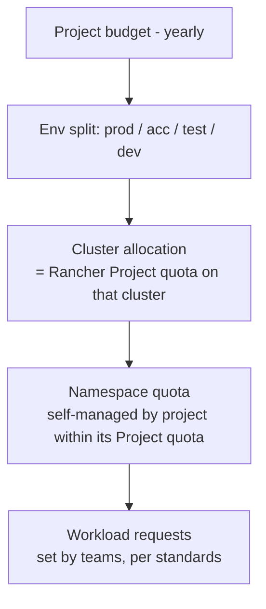

# 3. Allocation Model (budget → quota)

How a project's budget translates into guaranteed capacity per cluster/environment.

## Allocation hierarchy



| Level | Owned by | Mechanism |
|---|---|---|
| Project budget | Project lead + finance | Budget process (outside this system) |
| Environment/cluster allocation | Platform team (approves), project lead (requests) | Rancher Project resource quota (Git-managed) |
| Namespace quota | Project lead / Rancher project owner | Namespace quota override within project limit |
| Workload requests | Development team | Deployment manifests / Helm values |

## What is allocated

The **quota dimensions** per Rancher Project per cluster:

| Dimension | Quota key | Allocated? |
|---|---|---|
| CPU requests | `requests.cpu` (Rancher: *CPU Reservation*) | **Yes – primary, billed** |
| Memory requests | `requests.memory` (Rancher: *Memory Reservation*) | **Yes – primary, billed** |
| Memory limits | `limits.memory` (Rancher: *Memory Limit*) | Yes – derived (= memory requests × env factor) |
| CPU limits | `limits.cpu` (Rancher: *CPU Limit*) | **No** (see [ADR-0003](adr/0003-cpu-limits.md)) |
| Persistent storage | `requests.storage` | Yes – if storage cost is significant |
| Object counts (pods, services, PVCs, LB services) | `pods`, `services.loadbalancers`, … | Guardrails only, not billed |

## Unit rates

A project's budget buys **capacity units**. Two rates, per platform:

- **€ per vCPU-month** (requested)
- **€ per GiB-month** (requested memory)

### On-prem

```
Total monthly cluster cost (TCO) =
      hardware amortisation (servers, 3–5 yrs)
    + DC costs (power, cooling, rack space)
    + licences (Rancher/SUSE support, OS, virtualisation if any)
    + platform team effort share
    + shared services (monitoring, logging, backup, registry)

Sellable capacity = Σ node allocatable − system reservations − headroom (see below)

Split cost between CPU and memory by a fixed ratio (e.g. from server cost breakdown, typically ~50/50 to 60/40),
then:
    rate_cpu = cost_share_cpu / sellable vCPU
    rate_mem = cost_share_mem / sellable GiB
```

### AKS

Derive from the VM price of the node pool SKU (reserved instance / savings plan price if used) plus AKS
overhead (control plane tier, load balancers, disks, egress, monitoring). Same CPU/memory split method.

> Using **one blended rate** across on-prem and AKS is simpler for projects; using **separate rates** gives a
> true signal. Recommendation: separate rates, published yearly. See open question Q7.

### Illustrative example (made-up numbers)

| Item | Value |
|---|---|
| On-prem prod cluster monthly TCO | €20,000 |
| Sellable capacity | 400 vCPU, 1,600 GiB |
| CPU/memory cost split | 50 / 50 |
| rate_cpu | €10,000 / 400 = **€25 per vCPU-month** |
| rate_mem | €10,000 / 1,600 = **€6.25 per GiB-month** |

A project with a €3,000/month prod budget could, for example, get 60 vCPU (€1,500) + 240 GiB (€1,500).
The CPU/memory mix is chosen by the project based on its workload profile.

## Reference rates

Starting values for the unit rates, used as defaults in the
[allocation planner](../guides/allocation-planner.md#platforms-and-unit-rates) (as of September 2026, EUR per month).
The AKS figures are market prices; the on-prem figures are an estimate with stated assumptions. Both are placeholders
until finance publishes the organisation's own rates (open question Q7).

| Platform | per vCPU | per GiB | Basis |
|---|---|---|---|
| AKS, pay-as-you-go | 24.68 | 3.01 | Azure list price |
| **AKS, 1-year reservation** (planner default) | **14.84** | **1.82** | Azure list price |
| AKS, 3-year reservation | 9.53 | 1.17 | Azure list price |
| **On-prem, full cost** (planner default) | **10.60** | **1.23** | Estimate below |
| On-prem, without platform team | 6.16 | 0.71 | Estimate below |

### AKS: derived from Azure's price list

AKS charges for the node VMs (plus an optional cluster tier), so the rates come from VM prices:

1. **Prices:** [Azure Retail Prices API](https://prices.azure.com/api/retail/prices), `currencyCode='EUR'`,
   region `westeurope`, `serviceName eq 'Virtual Machines'`, Linux (product names without *Windows*), without spot,
   low-priority and dev/test prices. Families Dsv5, Dasv5, Dsv6, Dasv6 (4 GiB per vCPU) and Esv5, Easv5, Esv6,
   Easv6 (8 GiB per vCPU), standard sizes from 2 to 64 vCPU. Monthly = hourly × 730; reservations = term price ÷ 12
   or ÷ 36.
2. **CPU / memory split:** for each same-size D/E pair, E has 4 GiB per vCPU more at the same vCPU count, so
   per GiB = (E − D) ÷ (4 × vCPUs) and per vCPU = D ÷ vCPUs − 4 × per GiB. The 28 pairs agree closely
   (pay-as-you-go: 22.25–25.86 per vCPU, 2.58–3.06 per GiB); the table uses the medians
   (24.14 / 2.80, 1 year 14.51 / 1.69, 3 years 9.32 / 1.09 per VM vCPU / GiB).
3. **Per allocatable unit:** quota is planned against allocatable capacity, and AKS reserves part of each node
   ([node resource reservations](https://learn.microsoft.com/azure/aks/node-resource-reservations)): on a
   D8s_v5 (8 vCPU, 32 GiB, 110 max pods) 180 m CPU kube-reserved and 20 MB × 110 + 50 MB memory plus a 100 Mi
   eviction threshold, leaving 97.8 % of CPU and 93 % of memory. VM rates ÷ these shares = the table.

Notes: Germany West Central costs the same as West Europe, North Europe about 7 % less. With Azure CNI Overlay's
default of 250 pods per node, memory allocatable drops to about 84 % (memory rate about 11 % higher). Not included:
the AKS Standard tier (uptime SLA, 0.0859 per cluster-hour, about 63 per cluster and month), node OS disks, load
balancers, public IPs and egress. The 1-year reservation is the default because the workloads are long-running
services; use pay-as-you-go or 3 years if the node pools are bought that way.

### On-prem: estimated total cost per node

Market data doesn't exist for the organisation's own data centre, so this is a cost model per Kubernetes node
(bare metal) with assumptions to replace by real figures:

| Cost per node and month | EUR | Assumption |
|---|---|---|
| Server hardware | 417 | 2 sockets, 64 cores / 128 threads, 512 GiB, NVMe, 25 GbE, 5-year warranty: 25,000 over 60 months |
| Power | 131 | 600 W average × PUE 1.5 × 0.20 per kWh |
| Rack space, network, cabling | 100 | share per node |
| Rancher Prime / SUSE subscription, OS support | 150 | per node |
| Shared services | 50 | monitoring, logging, backup, registry |
| Platform team | 611 | 2 FTE × 110,000 a year over a 30-node estate |
| **Total** | **1,459** | |

Sellable capacity: 126 vCPU / 496 GiB allocatable (128 threads / 512 GiB minus OS and kubelet), of which 75 % can be
sold as quota after N+1 and headroom = 94.5 vCPU / 372 GiB. The cost is split between CPU and memory in the market
price ratio (1 vCPU costs as much as 8.6 GiB, from the AKS medians), which gives **10.60 per vCPU and 1.23 per
GiB**. The platform team is the largest item; without it the rates are 6.16 / 0.71.

## Headroom and overcommit

Quota is only a *guarantee* if the sum of all project quotas fits into the cluster.

| Environment | Max Σ project `requests` quota vs. allocatable | Why |
|---|---|---|
| Prod | **≤ 80–85 %** | N+1 node failure tolerance, rolling updates (surge pods), platform components |
| Acc/Test | ≤ 100 % | Some tolerance for Pending pods during peaks |
| Dev | 100–150 % (overcommit) | Most dev workloads are idle; cheaper, capacity not guaranteed |

Rule: **the platform team must never approve allocations that break these ratios** — instead, this triggers
capacity expansion (see [05 Process](05-process.md#capacity-planning)).

A flat percentage only approximates N+1 on clusters with many similar nodes (with 2 nodes, losing one takes 50 %).
The [allocation planner](../guides/allocation-planner.md#parameters-clusters) therefore checks N+1 explicitly
against the real node sizes: Σ project quota ≤ allocatable − the N largest nodes − platform components' requests,
and the percentage on top (of allocatable minus platform) for rollout room. Each cluster's resource dashboard
shows the same N+1 picture for its current requests.

Also account for:

- **Rolling-update surge**: during a rollout, `maxSurge` pods count against quota. Projects need ~10–25 %
  headroom in their own quota, or use `maxSurge: 0`/`maxUnavailable` strategies.
- **HPA**: quota must cover `maxReplicas × requests`, not the average.
- **Platform namespaces** (`cattle-*`, `kube-system`, monitoring, ingress) are not in project quotas and are
  deducted from sellable capacity.

## Billing basis

| Option | Description | Pros | Cons |
|---|---|---|---|
| **A. Allocated quota** | Project pays for its Project quota, whether used or not | Matches a budget model; predictable; simple | Over-allocation wastes budget (incentive to return quota — good) |
| B. Actual requests | Pays for Σ requests of running pods | Fairer for fluctuating usage | Unpredictable; quota becomes "free" reservation |
| C. max(requests, usage) | Industry standard for shared cost | Captures bursting | Complex to explain; still unpredictable |

**Recommendation: A (allocated quota)** as the cost basis, with **efficiency showback** (usage / requests /
quota) to drive right-sizing and returning unused quota. See [ADR-0002](adr/0002-billing-basis.md).

## Environments

Budget per project is split over environments. Suggested defaults (project can deviate with justification):

- Non-prod allocations are cheaper per unit (overcommit in dev) → rate can be discounted by overcommit factor.
- Prod allocation should reflect the production footprint incl. HA (≥2 replicas) and surge headroom.
