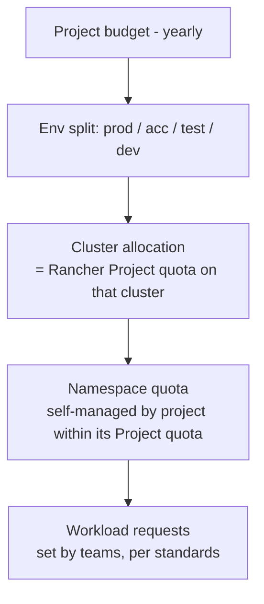

# 3. Allocation Model (budget → quota)

How a project's budget translates into guaranteed capacity per cluster/environment.

## Allocation hierarchy



| Level | Owned by | Mechanism |
|---|---|---|
| Project budget | Project lead + finance | Budget process (outside this system) |
| Environment/cluster allocation | Platform team (approves), project lead (requests) | Rancher Project resource quota (Git-managed) |
| Namespace quota | Project lead / Rancher project owner | Namespace quota override within project limit |
| Workload requests | Development team | Deployment manifests / Helm values |

## What is allocated

The **quota dimensions** per Rancher Project per cluster:

| Dimension | Quota key | Allocated? |
|---|---|---|
| CPU requests | `requests.cpu` (Rancher: *CPU Reservation*) | **Yes – primary, billed** |
| Memory requests | `requests.memory` (Rancher: *Memory Reservation*) | **Yes – primary, billed** |
| Memory limits | `limits.memory` (Rancher: *Memory Limit*) | Yes – derived (= memory requests × env factor) |
| CPU limits | `limits.cpu` (Rancher: *CPU Limit*) | **No** (see [ADR-0003](adr/0003-cpu-limits.md)) |
| Persistent storage | `requests.storage` | Yes – if storage cost is significant |
| Object counts (pods, services, PVCs, LB services) | `pods`, `services.loadbalancers`, … | Guardrails only, not billed |

## Unit rates

A project's budget buys **capacity units**. Two rates, per platform:

- **€ per vCPU-month** (requested)
- **€ per GiB-month** (requested memory)

### On-prem

```
Total monthly cluster cost (TCO) =
      hardware amortisation (servers, 3–5 yrs)
    + DC costs (power, cooling, rack space)
    + licences (Rancher/SUSE support, OS, virtualisation if any)
    + platform team effort share
    + shared services (monitoring, logging, backup, registry)

Sellable capacity = Σ node allocatable − system reservations − headroom (see below)

Split cost between CPU and memory by a fixed ratio (e.g. from server cost breakdown, typically ~50/50 to 60/40),
then:
    rate_cpu = cost_share_cpu / sellable vCPU
    rate_mem = cost_share_mem / sellable GiB
```

### AKS

Derive from the VM price of the node pool SKU (reserved instance / savings plan price if used) plus AKS
overhead (control plane tier, load balancers, disks, egress, monitoring). Same CPU/memory split method.

> Using **one blended rate** across on-prem and AKS is simpler for projects; using **separate rates** gives a
> true signal. Recommendation: separate rates, published yearly. See open question Q7.

### Illustrative example (made-up numbers)

| Item | Value |
|---|---|
| On-prem prod cluster monthly TCO | €20,000 |
| Sellable capacity | 400 vCPU, 1,600 GiB |
| CPU/memory cost split | 50 / 50 |
| rate_cpu | €10,000 / 400 = **€25 per vCPU-month** |
| rate_mem | €10,000 / 1,600 = **€6.25 per GiB-month** |

A project with a €3,000/month prod budget could, for example, get 60 vCPU (€1,500) + 240 GiB (€1,500).
The CPU/memory mix is chosen by the project based on its workload profile.

## Headroom and overcommit

Quota is only a *guarantee* if the sum of all project quotas fits into the cluster.

| Environment | Max Σ project `requests` quota vs. allocatable | Why |
|---|---|---|
| Prod | **≤ 80–85 %** | N+1 node failure tolerance, rolling updates (surge pods), platform components |
| Acc/Test | ≤ 100 % | Some tolerance for Pending pods during peaks |
| Dev | 100–150 % (overcommit) | Most dev workloads are idle; cheaper, capacity not guaranteed |

Rule: **the platform team must never approve allocations that break these ratios** — instead, this triggers
capacity expansion (see [05 Process](05-process.md#capacity-planning)).

Also account for:

- **Rolling-update surge**: during a rollout, `maxSurge` pods count against quota. Projects need ~10–25 %
  headroom in their own quota, or use `maxSurge: 0`/`maxUnavailable` strategies.
- **HPA**: quota must cover `maxReplicas × requests`, not the average.
- **Platform namespaces** (`cattle-*`, `kube-system`, monitoring, ingress) are not in project quotas and are
  deducted from sellable capacity.

## Billing basis

| Option | Description | Pros | Cons |
|---|---|---|---|
| **A. Allocated quota** | Project pays for its Project quota, whether used or not | Matches a budget model; predictable; simple | Over-allocation wastes budget (incentive to return quota — good) |
| B. Actual requests | Pays for Σ requests of running pods | Fairer for fluctuating usage | Unpredictable; quota becomes "free" reservation |
| C. max(requests, usage) | Industry standard for shared cost | Captures bursting | Complex to explain; still unpredictable |

**Recommendation: A (allocated quota)** as the cost basis, with **efficiency showback** (usage / requests /
quota) to drive right-sizing and returning unused quota. See [ADR-0002](adr/0002-billing-basis.md).

## Environments

Budget per project is split over environments. Suggested defaults (project can deviate with justification):

- Non-prod allocations are cheaper per unit (overcommit in dev) → rate can be discounted by overcommit factor.
- Prod allocation should reflect the production footprint incl. HA (≥2 replicas) and surge headroom.
