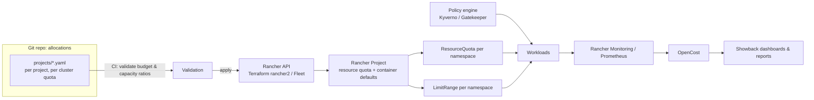

# 4. Technical Design

## Overview



Four building blocks:

1. **Allocation as code** — the source of truth for who gets what.
2. **Enforcement** — Rancher Project quotas (+ LimitRange defaults) and admission policies.
3. **Visibility** — usage vs. requests vs. quota, and cost, per project.
4. **Right-sizing** — recommendations to keep requests close to real need.

---

## 4.1 Enforcement with Rancher Project quotas

Rancher Projects natively support resource quotas:

- **Project Limit** — total for the whole Rancher Project on that cluster.
- **Namespace Default Limit** — quota each new namespace in the project gets by default.
- Per-namespace **override** — a project owner can give a namespace a different quota, as long as the sum of
  namespace quotas stays within the Project Limit. Rancher rejects namespace creation/changes that would exceed it.
- Rancher renders these as a standard Kubernetes `ResourceQuota` object in each namespace.
- **Container Default Resource Limit** on the project → rendered as a `LimitRange` in each namespace, so pods
  without requests/limits still get values (required: once a quota exists for a resource, Kubernetes rejects pods
  that do not specify it).

This maps directly onto the model in [03](03-allocation-model.md):

| Model | Rancher |
|---|---|
| Cluster allocation per project | Project Limit |
| Self-service split over namespaces | Namespace Default Limit + per-namespace overrides |
| Defaults for workloads | Container Default Resource Limit |

### Important behaviours / gotchas

- Enabling a quota on an existing project with namespaces whose usage already exceeds it does **not** kill running
  pods, but blocks new pods (including rollouts and restarts after node drain!). Roll out carefully — see [06](06-rollout.md).
- Namespaces **not assigned to any Rancher Project** are not covered. Policy: every tenant namespace must be in a
  project; unassigned namespaces are reported and blocked by policy.
- Rolling updates need surge headroom inside the quota.
- Who holds the **Project Owner** role decides who can move quota between namespaces. Proposed: project lead(s)
  are project owners; developers are project members (cannot change quota).
- Quota is **per cluster**. The same Rancher Project name on dev/test/prod clusters are separate objects with
  separate quotas.

### AKS clusters

| If AKS clusters are… | Mechanism |
|---|---|
| Imported into / provisioned by Rancher | Same Rancher Project quotas — identical model |
| Not managed by Rancher | Plain `ResourceQuota` + `LimitRange` per namespace, deployed by GitOps (Flux/Argo/Fleet), generated from the same allocation files; project grouping via namespace labels |

Preferred: import AKS clusters into Rancher to keep one mechanism. (Open question Q1.)

---

## 4.2 Allocation as code

Quotas must not be edited by hand in the Rancher UI. Source of truth is a Git repo; changes go via pull request
(which *is* the request/approval workflow — see [05](05-process.md)).

Example allocation file (format is a proposal):

```yaml
# allocations/projects/payments.yaml
project: payments
costCenter: CC-1234
owners: [payments-lead@corp]
budget:
  currency: EUR
  monthly: 6000
allocations:
  - cluster: onprem-prod-01
    env: prod
    quota:
      requests.cpu: "60"
      requests.memory: 240Gi
      limits.memory: 240Gi
      pods: "300"
    namespaceDefault:
      requests.cpu: "10"
      requests.memory: 40Gi
      limits.memory: 40Gi
  - cluster: onprem-test-01
    env: test
    quota:
      requests.cpu: "20"
      requests.memory: 80Gi
      limits.memory: 160Gi
```

Implementation options for applying it:

| Option | How | Pros | Cons |
|---|---|---|---|
| **A. Terraform `rancher2` provider** | `rancher2_project` resources with `resource_quota` and `container_resource_limit` blocks, generated from the YAML | Mature, plan/diff visible in PR, state tracks drift | Needs TF state + pipeline; Rancher API token management |
| B. Fleet / GitOps of Rancher `Project` CRs | Apply `management.cattle.io/v3` `Project` objects on the Rancher local cluster | Native GitOps, no extra tool if Fleet is used | Relies on Rancher internal CRD shape; less validation |
| C. Custom controller/script | Script calling Rancher API | Full control | Maintenance burden |

Recommendation: **A (Terraform)**, with a CI step that validates:

- Σ allocations per cluster ≤ capacity ratio for that environment ([03](03-allocation-model.md#headroom-and-overcommit)).
- Cost of allocations (quota × unit rate) ≤ project budget.
- Schema/required fields (owner, cost center).

See [ADR-0001](adr/0001-enforcement-mechanism.md).

---

## 4.3 Admission policies

Rancher quotas cap totals; a policy engine enforces the **standards** from [02](02-resource-standards.md) and
tenancy hygiene.

| Policy | Mode (initial → target) |
|---|---|
| Containers must set CPU & memory requests (S1) | Audit → Enforce |
| Containers must set memory limit (S2) | Audit → Enforce |
| Memory limit = request in prod (S3) | Audit → Enforce (prod) |
| Deny `PriorityClass` reserved for platform (e.g. `system-*`, `platform-critical`) in tenant namespaces | Enforce |
| Tenant namespaces must belong to a Rancher Project / carry project labels | Audit → Enforce |
| Warn if request > X (e.g. 8 vCPU / 32Gi per container) | Warn |

Tool options: **Kyverno** (YAML policies, easy mutations/reporting, available in Rancher Apps) or
**OPA Gatekeeper** (Rego, available in Rancher Apps). Recommendation: Kyverno for readability and
PolicyReports, unless Gatekeeper is already in use. (Open question Q5.)

### Priority classes

Define a small fixed set, cluster-wide:

| PriorityClass | Value | Who |
|---|---|---|
| `platform-critical` | 1,000,000 | Platform components only |
| `tenant-high` | 10,000 | Prod business-critical services (on request) |
| `tenant-default` (globalDefault) | 1,000 | All tenant workloads |
| `tenant-low` | 100 | Non-critical / batch-ish jobs |

Use of higher classes can be restricted per namespace with `ResourceQuota` `scopeSelector` on `PriorityClass`.

---

## 4.4 Visibility and showback

| Need | Tool |
|---|---|
| Quota vs. used (requests) per project/namespace | kube-state-metrics (`kube_resourcequota`) via Rancher Monitoring → Grafana |
| Requests vs. actual usage (efficiency) | Prometheus (cAdvisor + kube-state-metrics) |
| Cost per project | **OpenCost** with custom on-prem pricing (unit rates from [03](03-allocation-model.md)); on AKS with Azure pricing |
| Periodic report per project | Monthly export (OpenCost API / Prometheus query → CSV/report) |

Aggregation key: Rancher adds `field.cattle.io/projectId` to namespaces; additionally require labels
`project`, `cost-center`, `env` on namespaces (set by the allocation pipeline) so reporting works the same
on non-Rancher clusters.

Key dashboard per project:

```
Quota (allocated)  ████████████████████ 60 vCPU   → what you pay for
Requested          ██████████████       42 vCPU   → 70 % of quota
Used (P95)         ██████               18 vCPU   → 43 % of requests
```

Efficiency metrics: `requests / quota` (allocation utilisation) and `usage / requests` (right-sizing).

---

## 4.5 Right-sizing support

- **Goldilocks** (VPA in recommendation mode) or **Robusta KRR** (Prometheus-based CLI/report, no in-cluster
  VPA needed) to produce request recommendations per workload.
- Recommendations fed into the monthly report and to the req/lmt initiative.
- No automatic VPA updates for now (classic services, avoid restarts).
