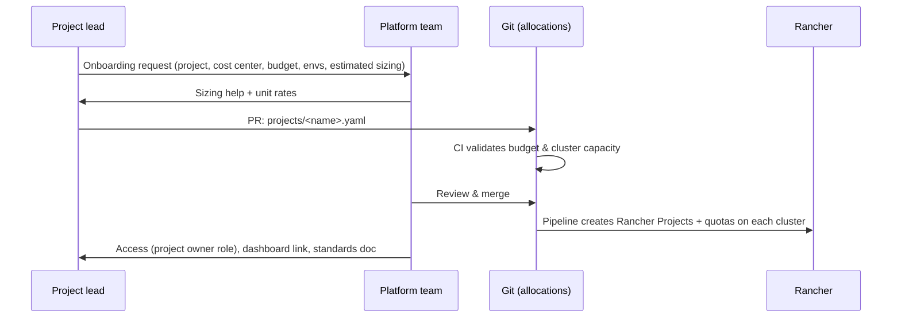

# 5. Process Design

## Process overview

| Process | Trigger | Cadence |
|---|---|---|
| [Onboarding](#onboarding-a-new-project) | New project/stream | Ad hoc |
| [Yearly allocation](#yearly-allocation-cycle) | Budget cycle | Yearly (aligned with budgeting) |
| [Change request](#quota-change-request) | Project needs more/less | Ad hoc |
| [Review & reclaim](#quarterly-review) | Calendar | Quarterly |
| [Capacity planning](#capacity-planning) | Allocation ratio thresholds | Continuous + quarterly |
| [Exceptions / emergencies](#emergency-increase) | Incident | Ad hoc |

## RACI

| Activity | Project lead | Platform team | Finance | Infra/DC | Management |
|---|---|---|---|---|---|
| Set project budget | R | C | A | – | I |
| Publish unit rates | I | R | A | C | I |
| Request allocation / change | R, A | C | I | – | – |
| Approve allocation (within budget & capacity) | I | R, A | – | – | – |
| Approve allocation above budget | C | C | A | – | R (escalation) |
| Split quota over namespaces | R, A | I | – | – | – |
| Right-size workloads | R, A | C | – | – | – |
| Capacity expansion | I | R | C | R | A |
| Monthly showback report | I | R | I | – | I |

R = responsible, A = accountable, C = consulted, I = informed.

---

## Onboarding a new project

Inputs required from the project:

- Project name, cost center, owners
- Budget (per year/month) and split across environments
- Estimated footprint per environment: #services × replicas × requests (template provided)
- Special needs: persistent storage, LoadBalancer services, high priority

## Yearly allocation cycle

1. **T-3 months**: platform team publishes next year's unit rates and a per-project report
   (current quota, average/peak requests, usage, recommendations).
2. **T-2 months**: projects submit budget + allocation proposal per environment.
3. **T-1 month**: platform team checks totals vs. capacity; triggers hardware procurement if needed
   (on-prem lead times!). Conflicts escalated to management.
4. **T0**: allocations merged and applied.

## Quota change request

- **How**: pull request on the allocation file (or a ticket that the platform team turns into a PR).
- **Auto-approvable** (just review for sanity) when:
  - within the project's budget, **and**
  - cluster stays within its headroom ratio, **and**
  - change is ≤ 25 % of current allocation.
- **Needs platform lead approval** when > 25 % or touching a cluster above 75 % allocated.
- **Needs budget owner/finance approval** when the change exceeds the project budget.
- **SLA target**: 2 working days for standard changes.
- **Decreases** are always approved immediately (returns capacity to the pool; lowers cost).

Within a project, moving quota **between its own namespaces** is self-service for the project owner
(no request needed).

## Quarterly review

Per project, the platform team shares:

- Allocation utilisation (`requests / quota`) and efficiency (`usage / requests`)
- Right-sizing recommendations
- Cost vs. budget

Rules of thumb:

| Signal | Action |
|---|---|
| `requests / quota` < 50 % for a full quarter | Propose quota reduction (reclaim) |
| `usage / requests` < 30 % | Right-sizing ticket to project |
| `requests / quota` > 90 % | Proactively discuss increase / risk of blocked deployments |

Reclaim is a proposal first; the project lead can justify keeping it (e.g. seasonal peaks).

## Capacity planning

Per cluster, monitor Σ project quotas vs. sellable capacity:

| Level | Threshold (prod) | Action |
|---|---|---|
| Green | < 70 % | Normal |
| Amber | 70–80 % | Start expansion plan; inform infra/DC |
| Red | > 80 % | Only decreases/emergencies approved until capacity is added |

For AKS: node pool scaling is fast, but the budget rule still applies (the allocation, not the autoscaler,
defines what projects get).

## Emergency increase

For incidents (e.g. production can't scale out):

1. On-call platform engineer may raise quota temporarily (via the same Git pipeline, with `emergency` label,
   or direct change + follow-up PR within 1 working day).
2. Temporary increase expires after e.g. 14 days unless a regular change request follows.
3. Logged and reported in the next quarterly review.

## Communication

- A single page for projects: standards, unit rates, how to request, dashboard links, FAQ.
- Monthly showback report per project (email/dashboard).
- Changes to standards or rates announced ≥ 1 quarter in advance.
