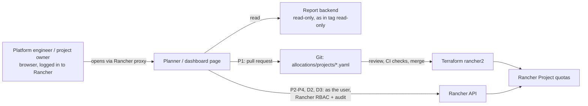

# 7. Actions from the Planner and Dashboard

Plan for turning the allocation planner and the resource dashboard from read-only views into tools that can act:
what to add, in which order, and under which rules. Status: **proposal**, nothing below is built yet.

## Starting point

The git tag [`read-only`](https://github.com/cdalar/cluster-resource-allocation/tree/read-only) (= release v0.3.1)
marks the last state in which the tooling only reads:

- The **dashboard** (one per cluster) reads nodes, namespaces, pods, quotas, limit ranges, HPAs and metrics.
- The **allocation planner** (on the Rancher local cluster) reads Rancher clusters, nodes and Projects, stores its
  plan in its own volume and exports allocation files for the Git / Terraform flow
  ([04](04-technical-design.md#42-allocation-as-code)).
- Only exception: the optional name publisher writes one Fleet Bundle with the Project names.

Everything a person decides in the planner or sees on the dashboard still has to be carried out by hand: copy the
export into a pull request, change a quota in Rancher, move a namespace, open a ticket for a team.

## Principles

1. **Act as the logged-in user, not as the tool.** Both pages are opened through Rancher's proxy, so they are
   served from Rancher's own address. Their JavaScript can call Rancher's API with the user's own session (and
   Rancher's CSRF token). Then Rancher's RBAC decides what the user may do (a project owner can change their own
   Project's namespace quotas, a platform admin any quota), and Rancher's audit log records who did it. The
   backend keeps no write permissions and stays as in the `read-only` tag.
2. **Preview, then confirm.** Every action shows the change as before → after (quota values, the namespace's
   new Project, the pull request's files) and runs only after an explicit confirmation.
3. **Say where a change goes.** Git (pull request, reviewed and applied by Terraform) or directly to Rancher.
   Changes to project quota go through Git as long as [ADR-0001](adr/0001-enforcement-mechanism.md) stands.
4. **Never block running workloads by surprise.** Quota changes that would put a namespace below its current
   requests are flagged, and the first rollout uses a soft mode (see P3), in line with the phases of
   [06](06-rollout.md).
5. **Off by default.** Each action has its own switch in the chart; without it the page shows no action button.

## Actions for the allocation planner

| # | Action | What it does | Goes to | Needs |
|---|---|---|---|---|
| P1 | **Open pull request** | Turns the saved plan into a pull request on the allocations repository: one file per project, the planner's checks (budget, node failures, headroom) in the description | Git | Allocations repository; a Git token or GitHub App for the planner |
| P2 | **Apply to Rancher** | Sets each Project's quota (CPU and memory reservation, memory limit), namespace default quota and container defaults from the plan, after a before → after preview | Rancher, as the user | A new ADR allowing direct changes (supersedes part of ADR-0001) |
| P3 | **Staged rollout** | Mode for P2: *soft* sets quota to max(plan, current requests + margin) so nothing is blocked, *hard* sets the plan; shows per Project which namespaces would be blocked in hard mode | Rancher, as the user | P2 |
| P4 | **Create missing Rancher Projects** | Creates the Project where the plan gives quota to a project that doesn't exist on that cluster yet | Rancher, as the user | Same ADR as P2 |
| P5 | **Send allocation to owners** | Mails or posts each project's quota, cost and budget to the owners listed in the plan | Mail / Teams | Mail or Teams integration |

## Actions for the dashboard

| # | Action | What it does | Goes to | Needs |
|---|---|---|---|---|
| D1 | **Right-sizing proposal** | For namespaces with low efficiency (usage / requests < 30 %), suggested requests per workload (P95 usage × margin), as a patch to download or a pull request to the team's repository | Download / team's Git | Prometheus (Rancher Monitoring) for P95 usage |
| D2 | **Assign unassigned namespaces** | Moves a namespace without a Rancher Project into one; quota only covers namespaces in a Project | Rancher, as the user | Rancher permission to move namespaces |
| D3 | **Set container defaults** | For namespaces with containers without requests: applies the standard defaults of [02](02-resource-standards.md) as a LimitRange (Rancher container default limits) | Rancher, as the user | — |
| D4 | **Create a ticket** | Opens an issue (GitHub / Jira) for a right-sizing or node-failure finding, prefilled with the numbers | Issue tracker | Issue tracker integration |
| D5 | **Alert on N+1 breach** | Notifies when *Room for projects (N+1)* turns red, i.e. today's project requests wouldn't survive a node failure | Mail / Teams / Alertmanager | Notification channel |

## Order

| Step | Actions | Why this order |
|---|---|---|
| 1 | **P1** Open pull request | Fits the current design (ADR-0001) unchanged; turns "export and copy" into a workflow; the planner's checks become the review content |
| 2 | **D2, D3** | Small and clearly useful; prerequisites for quotas to work (namespaces in Projects, pods with requests) |
| 3 | **P2 + P3** (and P4) | Only after an ADR allows direct changes; with the soft mode first, so enabling quota can't block running workloads |
| 4 | **D1** | Together with Rancher Monitoring, so proposals use P95 usage instead of a snapshot |
| 5 | **P5, D4, D5** | Notifications once the channels are chosen |

## Risks

| Risk | Mitigation |
|---|---|
| A quota change blocks deployments or restarts | Preview shows namespaces whose requests exceed the new quota; soft mode first (P3); decreases confirmed separately |
| Plan and Rancher drift apart when both Git and direct changes are used | One route per change type, stated in the ADR; the planner shows *Rancher quota now* next to the plan |
| An action runs with more rights than the person has | Actions call Rancher's API as the logged-in user, never with a tool service account |
| Cross-site requests through Rancher's proxy | Rancher's CSRF token on every write, plus the planner's own request header as today |

## Open points

See [open questions](open-questions.md) Q13 and Q14: where the allocations repository lives and how the planner
may write to it, and whether direct changes in Rancher are allowed at all.
