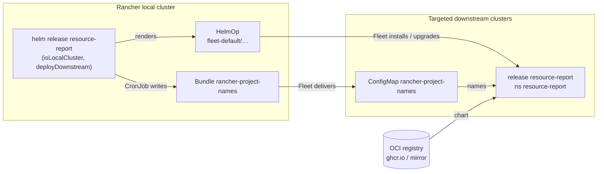

# 8. Deploying the Report to Downstream Clusters with Fleet

Plan for installing and upgrading the `cluster-resource-report` chart on downstream clusters through Fleet, from
the release on the Rancher local cluster, without a GitRepo. Status: **chart part built** (`rancher.deployDownstream`,
`templates/fleet-helmop.yaml`, chart README, installation guide Step 3 option A) and **tested** on the test Rancher
(Fleet v0.16.2, cluster `cra-downstream-2` through a ClusterGroup; see *Test results*). By default the chart
creates that ClusterGroup itself (`resource-report`, placeholder cluster `change-me`, so nothing is installed until
names are set); that default is not yet tested on Rancher. Still open: a release with it.

## Starting point

- Today every downstream cluster gets the chart by hand: a `helm upgrade --install` loop over kubectl contexts
  ([installation guide](../guides/installation.md), Step 3). Upgrades repeat that loop on every cluster.
- Only the Rancher Project names already reach downstream clusters through Fleet. The `publishNames` CronJob on
  the local cluster writes the Bundle `fleet-default/rancher-project-names`, and Fleet copies its ConfigMap to
  the downstream clusters.
- The test Rancher (v2.15.2) runs Fleet v0.16.2. Its HelmOps controller is deployed by default, and the
  `helmops.fleet.cattle.io` CRD offers the fields below:

| Field | Use |
|---|---|
| `helm.repo`, `helm.chart`, `helm.version` | Where the chart comes from (an OCI registry works) |
| `helm.releaseName`, `helm.values` | Release name and values downstream |
| `targets` | Which clusters get it |
| `namespace` / `defaultNamespace` | Release namespace downstream |
| `helmSecretName`, `insecureSkipTLSVerify` | Private registry or mirror |
| `pollingInterval` | Checking the registry for new versions |

## Decisions

| Question | Decision | Why |
|---|---|---|
| How the chart reaches Fleet | The local release renders one Fleet **`HelmOp`** that points at the OCI chart | Needs no new code, no CronJob and no pod. The object is static configuration, so Helm can own it directly. The names Bundle needs a CronJob only because its content changes. |
| Alternative not taken | A CronJob writes a Bundle with the chart files embedded (like the names publisher) | Would work without a chart registry, but it means new Python code, more RBAC, the chart baked into the image, and a CronJob for something static |
| Chart version downstream | **Follows the local release** (`.Chart.Version`), and can be overridden | `helm upgrade` on the local cluster rolls every targeted cluster to the same version |
| Which clusters | **Explicit targets only.** There is no default, so an empty target is an error rather than "all clusters" | The chart must never be installed everywhere by accident |

Requirements:
- Fleet ≥ 0.12 (Rancher 2.11+).
- Downstream clusters can pull the chart from GHCR, Docker Hub or an internal mirror.



## Chart values

A new block under `rancher` in `charts/cluster-resource-report/values.yaml`. It applies to the local cluster
only and needs `isLocalCluster`.

```yaml
rancher:
  deployDownstream:
    enabled: true                     # rendered only with isLocalCluster and Fleet HelmOps; skipped elsewhere
    workspace: fleet-default          # Fleet workspace of the downstream clusters (the local cluster is in fleet-local)
    # Where to install; a cluster matching any target gets the chart. By default only the ClusterGroup, whose
    # placeholder change-me matches nothing. With no target at all the chart fails and asks for one.
    clusters: []                      # Fleet cluster names, each a name or {name: ..., values: {...}}
                                      #   (kubectl -n fleet-default get clusters.fleet.cattle.io)
    clusterSelector: null             # label selector on Fleet clusters, e.g. {matchLabels: {resource-report: enabled}}
                                      #   ({} = every cluster in the workspace, only if written explicitly)
    clusterGroup:                     # a plain name ("my-group") uses an existing group instead
      name: resource-report
      create: true                    # the chart creates the group (false: it must exist)
      clusterNames: [change-me]       # Rancher display names; the placeholder matches no cluster
    namespace: resource-report        # release namespace downstream (= publishNames.targetNamespace)
    releaseName: resource-report
    chart:
      repo: oci://ghcr.io/cdalar/charts/cluster-resource-report   # or docker.io / an internal mirror
      version: ""                     # default: this chart's version
    helmSecretName: ""                # Fleet secret (in the workspace) for a private registry
    insecureSkipTLSVerify: false
    values: {}                        # downstream values (prometheus, collection.window, ...), merged over the defaults
```

Example for the local cluster, extending `values-local.yaml`:

```yaml
rancher:
  isLocalCluster: true                # publishNames and deployDownstream are on by default here
  deployDownstream:
    clusterGroup:
      clusterNames: [onprem-prod-01, onprem-test-01]
    values:
      prometheus:
        enabled: true
      collection:
        window: 7d
```

## Template: `templates/fleet-helmop.yaml`

It follows the style of `templates/publish-names.yaml`: gated with `dig`, and the defaults merged in the template
so that `--reuse-values` upgrades from older releases keep working.

`enabled` is `true` by default. The template renders nothing, without an error, when `isLocalCluster` is not
set (downstream and plain clusters) or `fleet.cattle.io/v1alpha1/HelmOp` is not in `.Capabilities.APIVersions`
(Fleet < 0.12 / Rancher < 2.11; `NOTES.txt` says so). It fails with a clear message when:
- `clusters`, `clusterSelector` and `clusterGroup` are all empty;
- the chart creates the group and `clusterGroup.clusterNames` is empty;
- `publishNames` is enabled and its `targetNamespace` differs from `deployDownstream.namespace`.

With `clusterGroup.create` (the default) it renders a Fleet `ClusterGroup` `clusterGroup.name` in the workspace,
selecting `management.cattle.io/cluster-display-name` *In* `clusterGroup.clusterNames` (see *Choosing clusters*).

It renders one `HelmOp`:

| Field | Value |
|---|---|
| name / namespace | `crr.fullname` / `workspace`, with `crr.labels` |
| `spec.defaultNamespace` | `deployDownstream.namespace`. Not `spec.namespace`: with it Fleet rejects every cluster-scoped object ("invalid cluster scoped object … NavLink"), found in the test |
| `spec.helm.releaseName` | `deployDownstream.releaseName` |
| `spec.helm.repo` | The chart's full OCI URL, with no `chart` field. Tested on Fleet v0.16.2: `chart: oci://…` without `repo` is rejected ("non-tarball chart with an empty repo field"), and so is `repo` + `chart` for OCI ("OCI repository with a non-empty chart field") |
| `spec.helm.version` | `chart.version`, default `.Chart.Version` |
| `spec.helm.values` | Defaults, then `mergeOverwrite` with `deployDownstream.values` (see below) |
| `spec.targets` | `{clusterName: …}` per entry in `clusters` (with `helm.values` = common values + that entry's `values` when given), plus `{clusterSelector: …}` and `{clusterGroup: …}` when set. Fleet treats targets as OR. |
| `spec.helmSecretName`, `spec.insecureSkipTLSVerify` | Only when set |

The default downstream values are (the local-only settings `isLocalCluster`, `publishNames`, `deployDownstream`,
`planner` and `capacityPlanner` are always switched off after `deployDownstream.values` is applied):
- `rancher.namesConfigMap.enabled`: equal to `publishNames.enabled`;
- `image.repository`, `image.pullPolicy` and `imagePullSecrets`: copied from the local values, so an air-gapped
  mirror is configured once.

`image.tag` is left out on purpose. Downstream uses its own chart's appVersion, which is the same version.

The template adds no RBAC and no pod. Helm, running as the installer (a Rancher admin), creates the HelmOp, and
the dashboard's service account stays read-only. `NOTES.txt` prints `kubectl -n <workspace> get helmops,bundles`
when the feature is enabled.

## Choosing clusters

There are three ways to choose clusters, and they can be combined:

| Way | How | Suits |
|---|---|---|
| By name | `clusters: [cra-downstream-2, onprem-prod-01]` | A few clusters. Explicit, but adding one means a `helm upgrade` on the local cluster |
| By label (recommended for many clusters) | In the Rancher UI, go to Cluster → Edit Config → Labels and add, e.g., `resource-report=enabled`. Then set `clusterSelector.matchLabels`. | A new cluster opts in by getting the label, with no Helm change. Rancher copies cluster labels to the Fleet cluster. |
| By cluster group (default) | `clusterGroup.clusterNames: [cra-downstream-2, onprem-prod-01]`: the chart creates the group `resource-report`. The default `change-me` matches no cluster. | One list of Rancher names; adding a cluster is an edit of the list and a `helm upgrade` |
| By an existing group | `clusterGroup.create: false` (or `clusterGroup: <name>`) | Teams that keep the group in the Rancher UI, changed without Helm |

A Fleet ClusterGroup has only a label selector (`spec.selector`), not a list of names. Rancher labels every Fleet
cluster with its name, though: `management.cattle.io/cluster-display-name` holds the display name and
`management.cattle.io/cluster-name` the stable ID (`c-m-…`). So a group can still select clusters by name:

```yaml
apiVersion: fleet.cattle.io/v1alpha1
kind: ClusterGroup
metadata:
  name: resource-report
  namespace: fleet-default          # same workspace as the HelmOp
spec:
  selector:
    matchExpressions:
      - key: management.cattle.io/cluster-display-name   # or management.cattle.io/cluster-name for IDs
        operator: In                                      # NotIn = all except these
        values: [cra-downstream-2, onprem-prod-01]
```

The chart renders this group from `clusterGroup.clusterNames`. Use `kubectl -n fleet-default get clustergroups`
to see how many clusters match. A group of the same name created by hand before blocks the install (Helm does not
adopt objects it did not create): delete it, or keep it with `clusterGroup.create: false`.

To keep the group out of Helm (`clusterGroup.create: false`), so that changing the list needs no `helm upgrade`,
create it in the Rancher UI:
1. Open ☰ → **Continuous Delivery**, and select the workspace **fleet-default** at the top.
2. Go to **Cluster Groups** → **Create** and name it `resource-report`.
3. Under **Cluster Selectors**, add a rule: key `management.cattle.io/cluster-display-name`, operator *in list*,
   and the cluster names as values. The form shows how many existing clusters match.
4. If the form won't take that key, use **Create from YAML** (or **Import YAML** in the top bar) with the
   manifest above. Or label the clusters yourself (Cluster Management → cluster → ⋮ → Edit Config → Labels,
   e.g. `resource-report=enabled`) and select on that label.

Removing a cluster from the targets (a name, a label, or group membership) makes Fleet uninstall the chart there.

The names Bundle (`publishNames.clusterSelector`, default `{}`) still goes to every cluster in the workspace.
That is harmless, since it is only a ConfigMap of names, but it can use the same selector.

## Lifecycle

| Action | Effect |
|---|---|
| `helm upgrade` of the local release to a new version | The HelmOp version changes, and Fleet upgrades every targeted cluster |
| Change `deployDownstream.values` | Fleet rolls out the new values |
| `helm uninstall` of the local release | The HelmOp is deleted, **and Fleet uninstalls the chart on all targeted clusters**. The downstream dashboards hold only a report that can be collected again. Plans live on the local cluster in ConfigMaps kept with `helm.sh/resource-policy: keep`. |
| A cluster registered with a matching label | Fleet installs the chart there |

## Migrating the existing manual installs

The HelmOp uses the same release name and namespace as the manual installs (`resource-report` /
`resource-report`), and Fleet takes an existing release over in place (tested): adding the cluster to the targets
is the whole migration.

## Test results

Test Rancher v2.15.2, Fleet v0.16.2; local release from `main` with `deployDownstream.clusterGroup:
resource-report`, a ClusterGroup selecting `cra-downstream-2` by `management.cattle.io/cluster-display-name`.

| Check | Result |
|---|---|
| OCI chart form | Only `repo: oci://…/cluster-resource-report` with no `chart` is accepted |
| `spec.namespace` | Rejected every cluster-scoped object (NavLink, ClusterRole): the chart uses `spec.defaultNamespace` |
| Existing hand-installed release (0.4.1, revision 6) | Taken over in place: revision 7, chart 0.5.2, HelmOp values, local-only settings off |
| Downstream dashboard | Pod on image `0.5.2`, names from the Fleet-delivered ConfigMap, Prometheus used, NavLink and ClusterRole present |
| Cluster removed from the group | Fleet uninstalled the release, Deployment, NavLink and ClusterRole; the names ConfigMap (own Bundle) stayed |
| Cluster added back | Fresh install (revision 1) |
| Timing of group changes | Applied only on the next "Cluster changed" event (agent check-in, up to ~15 min); annotating the Fleet cluster applied it in ~25 s, **Force Update** on the App Bundle (`forceSyncGeneration`) in ~10 s |

**Group changes are not immediate.** Fleet re-matches a ClusterGroup only when a cluster changes, which normally
happens at the cluster agent's next check-in (up to about 15 minutes). To apply a change now, use **Force Update**
on the App Bundle: Continuous Delivery → App Bundles → `resource-report-cluster-resource-report` → ⋮ → **Force
Update** (it raises `spec.forceSyncGeneration`; tested: the chart was installed about 10 seconds later). With
kubectl: `kubectl -n fleet-default patch helmop resource-report-cluster-resource-report --type merge -p
'{"spec":{"forceSyncGeneration":<current + 1>}}'`, or touch the Fleet cluster with
`kubectl -n fleet-default annotate clusters.fleet.cattle.io <cluster> resource-report/resync="$(date +%s)" --overwrite`.


## Documentation to update

AGENTS.md requires these to stay in sync:

| File | Change |
|---|---|
| `charts/cluster-resource-report/README.md` | A new "Deploy to downstream clusters with Fleet" section next to publishNames, rows in the values table, and the permissions paragraph (the HelmOp is created by the release, not by the dashboard). It replaces the vague "roll it out to all clusters with Fleet" line. |
| `guides/installation.md` | Step 3 becomes "Option A: Fleet" and "Option B: manual loop". Also update choosing clusters, the diagram, the read-only sentence, Upgrade, Uninstall (the warning above) and troubleshooting (`kubectl -n fleet-default get helmops,bundles`, and the HelmOp status under Continuous Delivery in the Rancher UI). |
| `AGENTS.md` | Add to the read-only exceptions: the chart (not the discovery code) may render one `HelmOp` that deploys this chart itself. It still never touches other workloads, quotas or Rancher objects. |
| `README.md` | The "only writes" sentence, the quick start and the diagram |
| `docs/07-actions.md` | The exception list in "Starting point" |
| `docs/open-questions.md` | Q6: Fleet is used for the tooling's own deployment. The quota tooling decision stays open. |

## Verification

1. **Tests and lint:**
   - `helm lint charts/cluster-resource-report`.
   - `helm template` with `rancher.isLocalCluster=true`, `rancher.deployDownstream.enabled=true`, a target, and
     `--api-versions fleet.cattle.io/v1alpha1/HelmOp`. Check the version (= Chart version), the merged values and
     the targets.
   - Each fail case above must fail: no HelmOp API, `isLocalCluster=false`, no target, and a namespace mismatch.
   - Run the unit tests in `discovery/` and `kibana/`. They are unchanged, but run them as a sanity check.
2. **Test Rancher (cra-report, not production):**
   - Upgrade the local release from the new chart with `clusters: [cra-downstream-2]` only. The other downstream
     boxes are offline or paused and stay that way.
   - Check that `kubectl -n fleet-default get helmops,bundles` is Ready.
   - On cra-downstream-2, check the release, the pod, that the names still come from the ConfigMap, and the
     dashboard via the Rancher proxy.
   - Settle the OCI repo/chart form and the adoption of the existing release.
   - Switch to a label selector (`resource-report=enabled` on cra-downstream-2) and confirm the same result.
   - Remove the target, confirm that Fleet uninstalls the chart, then put it back.
3. **Release:** commit to `main`. Releasing a new version (tag `vX.Y.Z`) is a separate step, and the feature only
   reaches users of the OCI chart after it.
