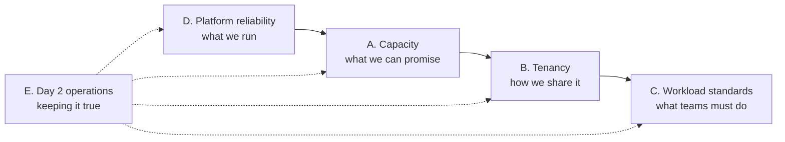

# 9. Operating Principles

The rules behind the allocation model, as short bullets: what we do, and why. Grouped from the **platform team's**
perspective: what we own, what we enforce, what we require from teams, and what keeps it working over time.
Details and numbers live in the linked docs; this page is the checklist to agree on and to point people to.

## Categories

| Category | Question for the platform team | Platform team role | Teams' role | Topics |
|---|---|---|---|---|
| [A. Capacity](#a-capacity--what-we-can-promise) | How much can we sell, and still keep the promise? | **Owns**: sizes clusters, approves quota | Request quota with evidence | [A1 N+1](#a1-n1-node-failure-tolerance), [A2 Conservative allocation](#a2-conservative-allocation), [A3 Autoscaling and bursts](#a3-autoscaling-and-bursts) |
| [B. Tenancy](#b-tenancy--how-we-share-it) | How do tenants share a cluster without hurting each other? | **Sets the rules and enforces** them (quota, policies, node pools) | Stay within their Project | [B1 Fairness](#b1-fairness-between-tenants), [B2 Priority and preemption](#b2-priority-and-preemption), [B3 Isolation](#b3-isolation-beyond-cpu-and-memory) |
| [C. Workload standards](#c-workload-standards--what-we-require-from-teams) | What must a workload look like to get the guarantees? | **Defines and checks** standards, provides defaults | **Implement** in manifests / Helm values | [C1 Requests vs. limits](#c1-requests-vs-limits-req--lmt), [C2 Replicas](#c2-replicas), [C3 Workload HA](#c3-workload-ha) |
| [D. Platform reliability](#d-platform-reliability--what-we-run) | Is the platform itself as available as what we promise? | **Owns** end to end | – | [D1 Platform HA](#d1-platform-ha) |
| [E. Day 2 operations](#e-day-2-operations--keeping-it-true-over-time) | Do the guarantees stay true after go-live? | **Runs** maintenance, monitoring, reviews | Right-size, fix drift, take part in reviews | [E1 Maintenance](#e1-maintenance), [E2 Monitoring and alerts](#e2-monitoring-and-alerts), [E3 Reviews and changes](#e3-reviews-and-changes) |

---

## A. Capacity — what we can promise

*Platform team owns. The guarantee in every other category depends on this one being right.*

### A1. N+1 (node failure tolerance)

- A cluster must be able to lose its **largest node** and still run every project's full quota.
- Check: Σ project quota ≤ allocatable − largest node(s) − platform requests.
  The planner and each cluster's dashboard show this as **Room for projects (N+1)**
  ([allocation model](03-allocation-model.md#headroom-and-overcommit), [planner guide](../guides/allocation-planner.md)).
- Check it on **real node sizes**, not a flat percentage: with 3 nodes, one node is 33 % of the cluster; with 10, it's 10 %.
- Uneven node sizes: the largest node sets the reserve, so one oversized node makes the whole cluster expensive.
  Prefer nodes of equal size within a cluster.
- Prod: N+1 is mandatory. Acc/test: N+1 recommended. Dev: N+0 accepted (pods may stay Pending during a failure).
- N+2 only for clusters where two nodes can go down together (e.g. maintenance on one node plus a failure on another,
  or two VMs on one hypervisor host).
- **A failure domain is whatever goes down together**: a bare-metal server, a hypervisor host running several node VMs,
  a rack, a power feed. N+1 counts failure domains, not Kubernetes nodes (open question Q17, [D1](#d1-platform-ha)).
- N+1 also covers **planned** outages: a node drained for patching is a failed node for capacity purposes.
  Without N+1, every upgrade is a capacity incident.
- Control plane / etcd nodes are not counted as capacity for projects.
- When a cluster breaks N+1 (red tile), it's a capacity trigger: add a node or stop approving quota
  ([process](05-process.md#capacity-planning), action D5 in [07](07-actions.md)).

### A2. Conservative allocation

- **Never sell more than the cluster can guarantee** in prod: Σ quota ≤ min(N+1 limit, 80–85 % of allocatable minus platform).
- The remaining 15–20 % is **not spare capacity to sell**: it absorbs rolling-update surge, rescheduling after a
  failure, platform growth and emergencies.
- Allocate on **requests**, never on limits or on "peak memory seen once".
- **Memory is allocated more carefully than CPU**: CPU shortage slows pods down (throttling), memory shortage kills them
  (OOMKill, eviction).
- Start new projects at their **measured or estimated need**, not their budget ceiling. Unspent budget is fine;
  unused quota blocks others.
- Increase quota in steps, on evidence: usage and requests trending towards the quota, Pending pods, a planned launch.
- Keep a small **unallocated platform reserve** per cluster for emergency increases, so an incident doesn't have to wait
  for new hardware ([emergency increase](05-process.md#emergency-increase)).
- Overcommit (Σ quota > capacity) only in **dev**, knowingly, and never promise dev capacity as guaranteed.
- Quota that is allocated but idle for two quarterly reviews is a candidate to reclaim ([E3](#e3-reviews-and-changes)).
- Conservative ≠ stingy: a project that is short of quota will work around it (bigger pods elsewhere, fewer replicas,
  skipped HA). Say no to capacity we don't have, not to capacity that is justified.

### A3. Autoscaling and bursts

- **HPA**: quota covers `maxReplicas × requests`, not the average. `minReplicas` ≥ 2 in prod.
- An HPA that hits its quota stops scaling silently (pods stay Pending with a quota error): alert on it ([E2](#e2-monitoring-and-alerts)).
- **VPA** in recommendation mode only, as input for right-sizing; auto mode changes requests and therefore quota
  consumption without review.
- **Cluster autoscaler** (AKS): scales nodes for requests, but quota is still the budget boundary. The autoscaler's
  maximum node count must cover Σ quota + N+1, otherwise quota promises capacity the pool can't reach.
- On-prem there is no autoscaling of nodes: capacity is bought ahead, which is why allocation there is more conservative.
- **CronJobs and batch**: their requests count against quota while they run; schedule large jobs outside peak hours or
  give them their own quota.

---

## B. Tenancy — how we share it

*Platform team sets the rules and enforces them; tenants can't opt out.*

### B1. Fairness between tenants

- The tenant is the **Rancher Project** (one per stream), not the namespace. Quota is set per Project per cluster;
  the project splits it over its namespaces itself ([allocation model](03-allocation-model.md#allocation-hierarchy)).
- **Fairness = you get what you pay for**: a project's quota is guaranteed only because Σ quota fits the cluster
  ([A1](#a1-n1-node-failure-tolerance), [A2](#a2-conservative-allocation)). Without that, the scheduler is first come,
  first served.
- Kubernetes itself has **no fair-share scheduling** between tenants. Quota is the only mechanism that stops one tenant
  from taking all the capacity; that's why every project namespace gets a quota.
- **CPU under contention** is shared in proportion to requests: a project with twice the requests gets twice the CPU
  time. Using idle CPU above requests is allowed (no CPU limits, [ADR-0003](adr/0003-cpu-limits.md)) and never takes
  away another pod's requested CPU.
- **Memory is not shared fairly**: a pod using more than its request is the first to be evicted under node pressure.
  Hence memory limit = request in prod ([C1](#c1-requests-vs-limits-req--lmt)): nobody lives on borrowed memory.
- Same rules, same price for every project: one set of standards, published unit rates, same review cadence.
  Exceptions are written down with a reason and an end date.
- Special hardware (GPU, large-memory nodes) goes in **separate node pools** with taints, allocated and priced
  separately, so general workloads can't occupy it.
- Platform components (ingress, monitoring, logging, `cattle-*`, `kube-system`) are outside project quota and deducted
  from capacity before anything is sold — tenants don't pay for them via quota, and don't compete with them.
- Visibility is part of fairness: every project sees its own quota, requests and usage (dashboard, Kibana), and the
  showback compares projects on the same basis ([ADR-0002](adr/0002-billing-basis.md)).

### B2. Priority and preemption

- PriorityClasses, from high to low: **platform** (`system-cluster-critical` / `system-node-critical`), **prod**,
  **default**, **batch / best effort**.
- Preemption only makes sense when the cluster is short; with correct N+1 and headroom it should be rare.
- A high priority is **not a way around quota**: limit its use per namespace with a quota `scopeSelector` on
  `PriorityClass`, or a policy (Q5).
- Low-priority batch jobs can use capacity that is idle now, and are the first to be preempted when prod needs it.
- In mixed clusters (prod + non-prod on the same nodes, Q2), non-prod runs at lower priority.

### B3. Isolation beyond CPU and memory

- Quota protects CPU and memory. **Not isolated** by default: disk I/O, network bandwidth, ephemeral storage, PIDs,
  API server load. These are where noisy neighbours come from.
- **Ephemeral storage**: set `requests/limits.ephemeral-storage` in standards, or a pod filling `/var/log` or `emptyDir`
  can get a node evicted.
- **Object counts** as guardrails, not billed: pods, services, `services.loadbalancers`, PVCs, ConfigMaps/Secrets
  ([allocation model](03-allocation-model.md#what-is-allocated)).
- **Persistent storage**: `requests.storage` quota per storage class if storage is significant (Q8).
- **Network**: NetworkPolicies per project (default deny between Projects; Rancher Project Network Isolation where
  available). Security isolation, not bandwidth.
- **Access**: project owners manage their own namespaces and quota split; they can't change other Projects or
  cluster-scoped objects (Q9).
- Heavy I/O or network workloads that disturb neighbours get dedicated nodes (taints + tolerations), allocated like any
  other node pool.

---

## C. Workload standards — what we require from teams

*Platform team defines the standards, sets defaults and checks compliance; teams implement them. A workload that
doesn't follow them doesn't get the guarantees of A and B.*

### C1. Requests vs. limits (req < lmt)

- **Requests are the contract**: what the scheduler reserves, what quota counts, what the project pays for.
- Requests must be set on every container, including sidecars and init containers ([standards](02-resource-standards.md) S1, S8).
- **Memory, prod: limit = request.** No borrowed memory; a pod is killed by its own limit (OOMKill, visible to the team),
  not evicted because a neighbour ran the node out of memory.
- **Memory, non-prod: limit ≤ 2× request** allowed. The gap between request and limit is overcommit: fine while pods
  don't all peak at once; the cost is evictions when they do.
- **Why req < lmt on memory is risky**: the node is filled by requests, but pods may grow to their limits. When the sum
  of actual usage exceeds the node, the kubelet evicts pods above their requests — often not the pod that caused it.
- **CPU: limits optional**, ≥ 2× request if set ([ADR-0003](adr/0003-cpu-limits.md)). req < lmt on CPU is safe: CPU is
  compressible, and requests still guarantee each pod its share.
- Tight CPU limits (limit = request) cause throttling even on an idle node — bad for latency and JVM startup.
- **QoS**: with no CPU limit, pods are `Burstable`, not `Guaranteed`. Acceptable; the eviction risk comes from memory
  above request, which prod rules out anyway.
- `BestEffort` (no requests) is not allowed anywhere: it can't be accounted for and is evicted first (S5).
- Requests should be **right-sized** to ~P95 of usage (S6): too high wastes quota, too low causes throttling and evictions.
- Runtimes must respect the container limit (e.g. `-XX:MaxRAMPercentage=75` for JVMs, S7).
- Enforcement: Rancher container defaults (LimitRange) fill gaps; a policy (Kyverno/Gatekeeper, Q5) or the LimitRange's
  `maxLimitRequestRatio` can enforce the memory ratio per environment.

### C2. Replicas

- **Prod: at least 2 replicas** for every stateless service; a single replica means downtime at every drain, upgrade and
  node failure.
- **Size for N−1 replicas**: with 2 replicas, one pod must carry the full load while the other restarts. With 3+, each
  pod can be smaller.
- **Quorum-based systems** (etcd, ZooKeeper, Kafka controllers, consensus DBs): 3 or 5 replicas, odd numbers.
- **Many small replicas beat few large ones**: they spread better, reschedule faster after a node failure and fit into
  the N+1 reserve. A single pod larger than the free space on any node can't be rescheduled at all.
- Quota must cover **replicas × requests + surge** (`maxSurge` pods during a rollout, ~10–25 %), or use
  `maxSurge: 0` / `maxUnavailable: 1` for large pods ([allocation model](03-allocation-model.md#headroom-and-overcommit)).
- **Single instance** workloads (stateful, licensed per instance, no leader election) are allowed but documented: they
  accept downtime on drains, and N+1 is checked for the pod itself (planner *Single instance* option).
- Non-prod: 1 replica is fine unless the environment is used to test HA behaviour (acc).

### C3. Workload HA

- **Spread replicas over failure domains**: `topologySpreadConstraints` on `kubernetes.io/hostname` (and on
  `topology.kubernetes.io/zone` / rack where nodes are labelled). Two replicas on one node are one replica.
- Prefer `topologySpreadConstraints` or **soft** (`preferred`) anti-affinity; hard anti-affinity with more replicas than
  nodes leaves pods Pending.
- **PodDisruptionBudget** for every prod workload with 2+ replicas: `maxUnavailable: 1` (or `minAvailable: N−1`).
- Never a PDB that allows zero disruptions (`minAvailable` = replicas, or `minAvailable: 1` with 1 replica): it blocks
  node drains and therefore every upgrade ([E1](#e1-maintenance)).
- **Readiness and liveness probes** are part of HA: without readiness, traffic goes to pods that aren't ready; a too
  strict liveness probe restarts healthy pods under load.
- `terminationGracePeriodSeconds` and a `preStop` delay so in-flight requests finish during rollouts and drains.
- **Across clusters**: for workloads that need more than node-level HA, run them active/active or active/passive on two
  clusters; each cluster then needs quota for its share (or for the full load, if one cluster must carry it alone).
- Stateful HA (databases, queues) follows the operator's/vendor's topology; its storage must not be tied to a single
  node (local volumes don't move after a node failure).

---

## D. Platform reliability — what we run

*Platform team owns end to end. Tenants' HA is only as good as the platform underneath.*

### D1. Platform HA

- **Control plane**: 3 control plane / etcd nodes per cluster (odd number), separate from worker capacity.
- **Rancher local cluster** on 3 nodes; downstream clusters keep running if Rancher is down, but management and quota
  changes stop.
- **Ingress controller** with 2+ replicas spread over nodes, with its own PDB; it's in the path of every tenant.
- **Platform components** (monitoring, logging, DNS, CNI, storage drivers) run with platform priority classes and their
  requests are deducted from capacity ([B1](#b1-fairness-between-tenants)).
- **On-prem VMs**: node VMs of one cluster should sit on different hypervisor hosts (anti-affinity at the
  virtualisation layer), otherwise one host failure takes several nodes and N+1 is false (Q17).
- **Failure domains labelled**: nodes carry `topology.kubernetes.io/zone` (rack / host group) so workloads can spread
  over them ([C3](#c3-workload-ha)).
- **etcd snapshots** and Rancher backups stored off-cluster ([E1](#e1-maintenance)).
- **AKS**: node pools over availability zones where the region has them; Standard tier (uptime SLA) for prod clusters.

---

## E. Day 2 operations — keeping it true over time

*Platform team runs it; teams take part in reviews and fix what's theirs.*

### E1. Maintenance

- **Node drains** must succeed without manual work: PDBs allow disruption ([C3](#c3-workload-ha)), the N+1 reserve
  absorbs the moved pods ([A1](#a1-n1-node-failure-tolerance)).
- **Upgrades** (Kubernetes, Rancher, OS, firmware) one node at a time; a drained node counts as the "+1".
  Don't start an upgrade on a cluster whose N+1 tile is red.
- **Backups**: etcd snapshots and Rancher backups stored off-cluster, restore tested at least yearly.
- **Housekeeping**: certificates and tokens rotated before expiry, unused namespaces and Projects removed (their quota
  returns to the pool), node sizes kept uniform when adding hardware.
- **Runbooks** for the recurring events: node failure, emergency quota increase, cluster at capacity, project onboarding
  and offboarding.

### E2. Monitoring and alerts

Alertmanager, or Kibana on the OTel metrics:

- N+1 breached on a cluster (D5 in [07](07-actions.md)).
- Project quota usage > 90 % for CPU or memory requests.
- Pods Pending for more than a few minutes (quota exceeded or no node fits).
- OOMKills and evictions per namespace.
- CPU throttling above a threshold (CPU limits too tight).
- Nodes `NotReady` or under memory/disk pressure.

### E3. Reviews and changes

- **Capacity reviews**: monthly look at allocation ratio and N+1 per cluster; quarterly review per project
  (quota vs. requests vs. usage), reclaim or right-size ([process](05-process.md)).
- **Quota changes** go through Git and review, like any other change ([ADR-0001](adr/0001-enforcement-mechanism.md));
  emergency increases are allowed and followed up with a PR.
- **Right-sizing loop**: VPA/KRR recommendations → team adjusts requests → quota freed or increased → review.
- **Standards drift**: workloads without requests, memory limit ≠ request in prod, defaulted values — shown on the
  dashboard and Kibana, fixed by the owning team.
