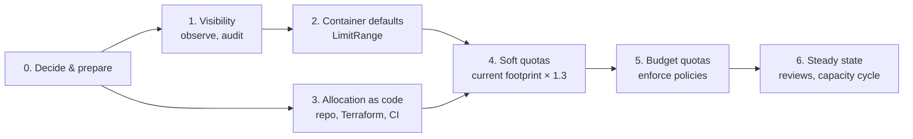
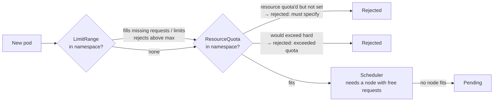
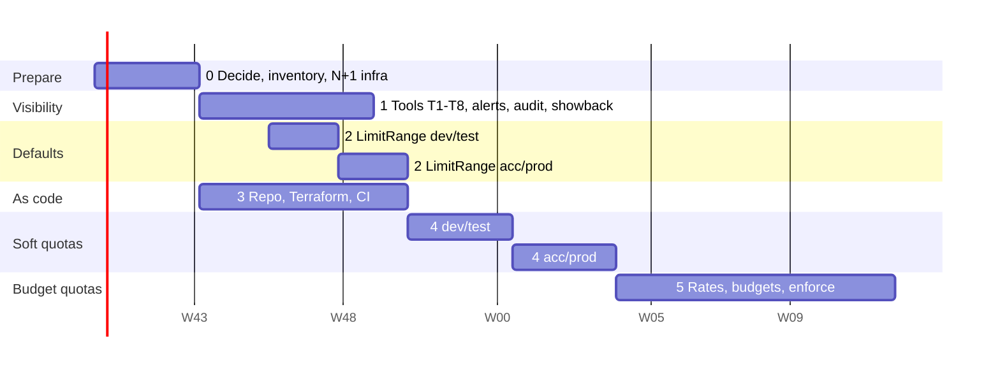

# 10. Implementation Plan

Step-by-step guide from today's state to budget-backed quotas on every cluster. It starts with an analysis of
where we are, then lists the steps in order, each with an owner, how to do it, and when it is done. It brings
together the [resource standards](02-resource-standards.md), the [allocation model](03-allocation-model.md), the
[technical design](04-technical-design.md), the [process](05-process.md) and the
[operating principles](09-operating-principles.md); it refines the phases of the [rollout plan](06-rollout.md).
Numbers and rules live in those docs; this one says **what to do in which order**. Status: **proposal**
(2026-10-01). Scope: the on-prem Rancher clusters; AKS follows the same steps once Q1 is answered.

## 1. Current status

### 1.1 Summary

| Area | Status | Where |
|---|---|---|
| Design | Drafts 01–09 written. ADR-0001 (Rancher Project quotas via Terraform), ADR-0002 (pay for allocated quota) and ADR-0003 (no CPU limit quota) are *Proposed*. Operating principles not yet agreed | [docs](.), [ADRs](adr/) |
| Open questions | 20 raised (Q20 by this plan), none answered, Q16 partly (Rancher licence counts CPU cores) | [open questions](open-questions.md) |
| Tooling | Released and usable (v0.6.4): dashboard per cluster with *Room for projects (N+1)*, allocation and capacity planners with N+1 and headroom checks and a what-if calculator, Kibana dashboards, Fleet install on downstream clusters. Tested on the test Rancher only | [README](../README.md), [installation guide](../guides/installation.md) |
| Enforcement | **None**: no Rancher Project quotas, no container defaults (LimitRange), no admission policies, no tenant PriorityClasses | [04](04-technical-design.md) |
| Allocation as code | File format proposed, planner exports it. No allocations repository, no Terraform, no CI validation (Q6, Q13) | [04.2](04-technical-design.md#42-allocation-as-code) |
| Process | Designed (RACI, change requests, reviews, emergency increase), not running | [05](05-process.md) |
| Finance | Reference unit rates are placeholders (AKS list prices, on-prem estimate). No rates published by finance, no budgets entered (Q3, Q7, Q12, Q16) | [03](03-allocation-model.md#reference-rates) |
| Capacity | N+1 is visible per cluster, but failure domains are unknown (bare metal vs. VMs on shared hosts, Q17); no alerts; Prometheus retention unknown (Q11) | [09 A1](09-operating-principles.md#a1-n1-node-failure-tolerance) |
| Workload standards | Proposals S1–S8; the separate requests/limits initiative is setting values on Deployments (Q4). PDBs, topology spread, PriorityClasses not known (Q18) | [02](02-resource-standards.md), [09 C](09-operating-principles.md#c-workload-standards--what-we-require-from-teams) |

In short: **we can see, but we can't yet enforce or decide.** The tools show the as-is picture and can plan
quotas; nothing is decided, applied or reviewed yet.

### 1.2 Gaps against the operating principles

Each principle in [09](09-operating-principles.md), what it needs, where we are, and the step in
[section 3](#3-steps) that closes the gap.

| Principle | Needs | Today | Step |
|---|---|---|---|
| A1 N+1 | Σ quota ≤ allocatable − largest failure domain − platform; failure domains known | N+1 per node shown on dashboard and planner; failure domains unknown; no quota yet | 0.4, 1.1, 4.2, 5.3 |
| A2 Conservative allocation | Σ quota ≤ min(N+1, 80 %) in prod; platform reserve per cluster | Planner checks it, but no quotas exist; reserve entered by hand per cluster | 0.3, 5.3 |
| A3 Autoscaling and bursts | Quota covers HPA `maxReplicas × requests`; alert when HPA hits quota | HPAs collected; no check against quota | 1.1, 1.3 |
| B1 Fairness | Every tenant namespace in a Rancher Project with a quota | No quotas; unassigned namespaces exist on some clusters | 1.6, 4.4 |
| B2 Priority and preemption | Fixed set of PriorityClasses; high classes limited per namespace | Unknown (Q18) | 5.5 |
| B3 Isolation | Ephemeral storage standard, object count guardrails, NetworkPolicies | None | 1.4, 4.1 |
| C1 Requests vs. limits | Requests everywhere, memory limit = request in prod, defaults for gaps | Defaults missing; compliance shown on dashboard | 2.1–2.4, 1.4, 5.4 |
| C2 Replicas | ≥ 2 in prod; no pod bigger than the free room after a node failure | Not checked | 1.1, 1.4 |
| C3 Workload HA | PDB (allowing disruption), topology spread, probes | Not checked (Q18) | 1.1, 1.4 |
| D1 Platform HA | 3 control plane nodes, Rancher on 3 nodes, ingress 2+ replicas with PDB, off-cluster backups | Unknown per cluster | 0.5 |
| E1 Maintenance | Drains succeed; upgrades only with N+1 green | Not tracked | 0.5, 6.1 |
| E2 Monitoring and alerts | N+1 breach, quota > 90 %, Pending, OOMKill, throttling, node pressure | No alerts; channel not chosen | 1.3 |
| E3 Reviews and changes | Quota changes via Git; monthly / quarterly reviews | No repository, no reviews | 3.1–3.4, 6.1 |
| F1 Cost model | Published unit rates | Placeholders | 5.1 |
| F2 Rancher licence | Licence per core in the CPU rate; node purchases planned with renewal | Price per core unknown (Q16) | 5.1, 6.1 |
| F3 Cluster size | Prod ≥ 3 equal worker nodes, better 5+ | Unknown per cluster | 0.4 |

### 1.3 Gaps in the capacity planning views

The dashboard, the capacity planner and the Kibana report show **requests** against capacity. Once quotas exist,
capacity planning is about **quota** (what is sold) against **room for projects** (what can be sold). Missing
today, all read-only additions:

| # | Missing view | Why | Where |
|---|---|---|---|
| T1 | Quota hard / used per namespace and per Project (today only the number of ResourceQuota objects) | *Quota vs. requests vs. usage* per project ([04.4](04-technical-design.md#44-visibility-and-showback)); reviews ([05](05-process.md#quarterly-review)) | Dashboard, CSV, Kibana |
| T2 | **Sold vs. sellable** per cluster: Σ project quota against room for projects (N+1) and the environment's max %, as a second line in *Cluster capacity* and a tile that turns amber at 70 %, red at 80 % or above N+1 | Capacity thresholds green / amber / red ([05](05-process.md#capacity-planning)) | Dashboard, Kibana |
| T3 | LimitRange per namespace: default request / limit values; containers whose values equal the defaults marked *probably defaulted* | Defaults hide missing requests ([discovery caveat](../discovery/README.md#caveats)) | Dashboard |
| T4 | Containers **without a memory limit whose P95 usage is above the planned default limit** | They are OOMKilled after the next restart once the default applies (step 2.2) | Dashboard, CSV |
| T5 | Largest pod per cluster against the free room after the largest node fails | A pod that fits no node after a failure can't be rescheduled ([09 C2](09-operating-principles.md#c2-replicas)) | Dashboard |
| T6 | Workload HA checks: prod workloads with 1 replica, no PDB, a PDB that allows no disruption, no topology spread | [09 C2, C3](09-operating-principles.md#c3-workload-ha); drains must succeed (E1) | Dashboard (needs read on Deployments, StatefulSets, PDBs) |
| T7 | N+1 by **failure domain**: group nodes by `topology.kubernetes.io/zone` (or a host label) and subtract the largest group | A hypervisor host with two node VMs is one failure ([09 A1](09-operating-principles.md#a1-n1-node-failure-tolerance), Q17) | Dashboard, planner |
| T8 | HPA `maxReplicas × requests` against the namespace quota | An HPA that hits its quota stops scaling silently (A3) | Dashboard |

All of them stay within the read-only rule of the tools (new read permissions only, in `rbac.yaml` and the chart).

## 2. How we roll out

Rules for every step below:

1. **Order matters.** Namespaces in Projects → container defaults (LimitRange) → generous quotas → budget quotas →
   enforced policies. Each step makes the next one safe ([section 5](#5-limitrange-and-project-quota-together)).
2. **Non-prod first.** dev → test → acc → prod, and on each environment one pilot project before all.
3. **Nothing running breaks.** Quota and LimitRange act at admission only: they never kill a running pod, but they
   can block the next rollout, restart or node drain. Every step names what to watch and how to roll back.
4. **Measured, then decided.** Each step has an exit criterion, read from the dashboard or the planner.
5. **Git from the start.** From step 3 on, every quota and default is a change in the allocations repository.

## 3. Steps

Owners use the roles of the [RACI](05-process.md#raci): PT = platform team, PL = project leads, FIN = finance,
INFRA = infrastructure / DC, ARCH = architecture / management, RL = requests/limits initiative.

### Phase 0. Decide and prepare (weeks 1–3)

**Step 0.1 Agree the principles and ADRs.** Owner: PT, ARCH, RL.

- Review [09 Operating principles](09-operating-principles.md) with architecture and the requests/limits initiative;
  record changes in the doc.
- Move ADR-0001, 0002 and 0003 from *Proposed* to *Accepted* (or rewrite them). ADR-0003 and S3 need the
  requests/limits initiative's agreement (Q4).
- Done when: 09 is agreed, the three ADRs are *Accepted*.

**Step 0.2 Answer the blocking open questions.** Owner: PT (with FIN, INFRA).

| Question | Blocks |
|---|---|
| Q1 AKS in Rancher? | Mechanism for AKS (Rancher quotas or plain ResourceQuota) |
| Q2 One environment per cluster? | Environment per cluster in the planner, headroom ratios |
| Q4 Agreed req/lmt standards | Container defaults (Phase 2), policies (1.4) |
| Q5 Policy engine in use? | Step 1.4 |
| Q6, Q13 GitOps / Terraform, where the allocations repository lives | Phase 3 |
| Q9 Who is Rancher Project Owner? | Self-service namespace split (4.3) |
| Q11 Prometheus retention | Peaks and P95 over a quarter (1.2) |
| Q17 Bare metal or VMs, host placement | N+1 by failure domain (0.4) |
| Q18 PriorityClasses, PDBs, spread already standard? | Steps 1.4, 5.5 |

The finance questions (Q3, Q7, Q10, Q12, Q16) are needed only by Phase 5; start them now because of the budget cycle.
Done when: the questions above are answered in [open questions](open-questions.md).

**Step 0.3 Inventory: dashboard on every cluster.** Owner: PT.

- Install the chart on the Rancher local cluster and, through the Fleet HelmOp, on every downstream cluster
  ([installation guide](../guides/installation.md), Steps 2–3). Prometheus on where Rancher Monitoring runs.
- On each cluster, check the *System* classification: platform namespaces outside Rancher's System project
  (ingress, storage, monitoring) must count as platform, not tenant
  ([mark more namespaces as System](../guides/installation.md#mark-more-namespaces-as-system)).
- In the **capacity planner**: set each cluster's environment, and enter each cluster's platform reserve from its
  dashboard's *System* requests (the planner measures it only for the local cluster).
- Download the CSVs of every cluster as the baseline (`clusters.csv`, `projects.csv`, `namespaces.csv`) and keep
  them with the date.
- Done when: every cluster appears with a dashboard, an environment and a platform reserve; baseline archived.

**Step 0.4 N+1 on the infrastructure: failure domains and cluster size.** Owner: PT, INFRA.

- Map every worker node to what it fails with: physical server, hypervisor host, rack, power feed (Q17).
- VMs: anti-affinity rules in the virtualisation layer, so a cluster's worker VMs sit on different hosts. Where that
  isn't possible, the largest **host** is the N+1 unit, not the largest node.
- Label nodes with `topology.kubernetes.io/zone` (rack or host group) so workloads and the dashboard (T7) can use it.
- Check every prod cluster against [F3](09-operating-principles.md#f3-cluster-size-minimum-worker-nodes-and-n1):
  ≥ 3 schedulable worker nodes, equal sizes, control plane / etcd separate. List deviations.
- Read the *Room for projects (N+1)* tile per cluster. Every red cluster gets an action (add a node, move a project)
  before Phase 4, because soft quotas there would sell capacity the cluster can't keep.
- Done when: N+1 status and failure domain are known per cluster; each red or undersized cluster has an owner and a
  date.

**Step 0.5 N+1 for the platform itself.** Owner: PT. Checklist per cluster ([D1](09-operating-principles.md#d1-platform-ha), [E1](09-operating-principles.md#e1-maintenance)):

| Check | Target |
|---|---|
| Control plane / etcd | 3 nodes, not counted as worker capacity |
| Rancher local cluster | 3 nodes |
| Ingress controller | 2+ replicas, spread over nodes, PDB `maxUnavailable: 1` |
| Platform components | Platform PriorityClasses, requests set (they form the platform reserve) |
| Backups | etcd snapshots and Rancher backup off-cluster; restore tested |
| Drain test | Drain one worker node in a maintenance window: completes without manual work, all pods reschedule |

Done when: the checklist is green or has dated actions per cluster.

### Phase 1. Visibility, observe only (weeks 3–8)

**Step 1.1 Close the tooling gaps.** Owner: PT.

- Build T1–T8 ([section 1.3](#13-gaps-in-the-capacity-planning-views)) in the dashboard (and T1, T2 in the Kibana
  report), in this order: T1, T2, T4, T3 (needed before Phases 2 and 4), then T5–T8.
- Keep the tools read-only; add read RBAC only. Release, upgrade through Fleet.
- Done when: a release with T1–T4 runs on every cluster.

**Step 1.2 History for peaks.** Owner: PT. Prometheus retention of at least 90 days (or the central Elastic,
Q15), so `max(requests, peak)` and P95 cover a full quarter. Done when: the dashboard no longer warns about less
history than its window.

**Step 1.3 Alerts.** Owner: PT. Choose the channel (Alertmanager or Kibana alerting, and where they land), then
alert on ([E2](09-operating-principles.md#e2-monitoring-and-alerts)):

| Alert | Source |
|---|---|
| Room for projects (N+1) red | Dashboard / Kibana (action D5 in [07](07-actions.md)) |
| Project quota usage > 90 % CPU or memory requests | `kube_resourcequota` (after Phase 4) |
| Pods Pending > 5 min, events *exceeded quota* / *must specify limits* | kube-state-metrics, events |
| OOMKills and evictions per namespace | kube-state-metrics |
| CPU throttling above threshold | cAdvisor |
| Node NotReady, memory / disk pressure | kube-state-metrics |

Done when: each alert fired once on a test cluster and reached the channel.

**Step 1.4 Policies in audit mode.** Owner: PT, with RL. Install Kyverno (unless Gatekeeper is in use, Q5) in
**audit** mode on all clusters, with the policies of [04.3](04-technical-design.md#43-admission-policies) plus:

- ephemeral-storage requests and limits ([B3](09-operating-principles.md#b3-isolation-beyond-cpu-and-memory)),
- prod: ≥ 2 replicas, PDB present and allowing one disruption, topology spread on hostname
  ([C2, C3](09-operating-principles.md#c3-workload-ha)),
- tenant namespaces must belong to a Rancher Project.

Done when: PolicyReports per namespace are visible and shared with the project leads (no blocking yet).

**Step 1.5 First showback and communication.** Owner: PT, with FIN.

- Enter the projects in the **allocation planner** with the reference rates and fill each row with *Requests +25 %*:
  a first price tag for today's footprint. Mark it as provisional.
- Publish the single page for projects ([05 Communication](05-process.md#communication)): standards, the coming
  defaults and quotas with dates, how to request, dashboard links.
- Send each project lead its numbers: requests, P95 usage, efficiency, standards gaps, provisional cost.
- Done when: every project lead has their report and the dates of Phases 2 and 4.

**Step 1.6 Every tenant namespace in a Project.** Owner: PT, PL.

- From the dashboard's *unassigned* list, agree with the owners which Project each namespace belongs to; move it in
  Rancher (action D2 in [07](07-actions.md), by hand for now). Namespaces nobody claims are candidates for removal.
- Done when: no tenant namespace is unassigned on any cluster; the policy from 1.4 reports none.

### Phase 2. Container defaults: LimitRange (weeks 6–10, per environment)

**Step 2.1 Choose the defaults.** Owner: PT, RL.

- Start from [02 Default values](02-resource-standards.md#default-values-when-a-workload-does-not-specify) and the
  baseline: the default request should be near the P95 of today's small containers, not of the largest.
- No default CPU limit ([ADR-0003](adr/0003-cpu-limits.md)). Memory default limit = memory default request in
  prod, ≤ 2× in non-prod (S3).
- Optional, later (Phase 5): `max` per container (e.g. 8 CPU / 32 GiB) and `maxLimitRequestRatio` for memory
  (1 in prod, 2 elsewhere) to enforce S3 at admission.

**Step 2.2 Remove the OOMKill risk first.** Owner: PL, PT.

- A container without a memory limit gets the default limit at its next restart. If it uses more, it is OOMKilled.
- From T4, list every container without a memory limit whose P95 usage is above the planned default limit. The
  team sets real values first (or the namespace gets a higher default, documented as an exception).
- Done when: T4 is empty for the namespaces in this wave.

**Step 2.3 Apply the defaults.** Owner: PT.

- Through the allocations repository (Phase 3) if ready, otherwise in Rancher and recorded in Git afterwards:
  Rancher Project → *Container Default Resource Limit* (Terraform `rancher2_project.container_resource_limit`).
- Rancher applies a Project's container defaults to namespaces **created afterwards**; set existing namespaces
  explicitly (`rancher2_namespace.container_resource_limit`). Verify on the test Rancher that every namespace has
  the LimitRange: `kubectl get limitrange -A`.
- Wave order: dev → test → acc → prod, one pilot project first in each.
- Effect: only new pods. Existing pods get the defaults when they restart (next rollout, drain, crash).
- Watch for 1 week per wave: OOMKills (alert 1.3), pods rejected by `max`, deploy failures.
- Rollback: remove or raise the default for that namespace.

**Step 2.4 Close the loop.** Owner: PL. Teams replace defaulted values with real requests (T3 shows *probably
defaulted* containers). Done when: every tenant namespace has a LimitRange, and after one restart cycle (for
example the next upgrade's drains) no pod runs without requests.

### Phase 3. Allocation as code (weeks 3–10, parallel to Phases 1–2)

**Step 3.1 Allocations repository.** Owner: PT. Create it where Q13 says; one file per project in the format of
[04.2](04-technical-design.md#42-allocation-as-code) (the planner's export); CODEOWNERS: project lead for their
file, platform team for all. Done when: the repository exists with the schema and a README.

**Step 3.2 Terraform for Rancher.** Owner: PT.

- Generate `rancher2_project` (with `resource_quota` → `project_limit` and `namespace_default_limit`, and
  `container_resource_limit`) and `rancher2_namespace` (per-namespace quota overrides and defaults) from the files.
- The Projects already exist: **import** them (`terraform import`), don't recreate them. Check that the first plan
  only adds quota and defaults.
- State backend, Rancher API token for a pipeline service account (not a person), plan in every pull request,
  apply on merge, a scheduled plan that reports drift.
- Done when: a pull request on the test Rancher changes a quota end to end.

**Step 3.3 CI validation.** Owner: PT. The same rules as the planner, so a red planner issue is a red build:
schema and owners; Σ project quota per cluster ≤ min(allocatable − largest failure domain − platform reserve,
environment max %); budget ≥ priced quota (from Phase 5); Σ namespace quotas ≤ Project quota.
Done when: a pull request that breaks N+1 on a test cluster fails.

**Step 3.4 Lock manual edits.** Owner: PT. Rancher roles: project leads are Project Owners for the namespace split
(Q9) but can't change the Project quota itself; only the pipeline's account can. Verify the role permissions on the
test Rancher. Done when: a project owner's attempt to raise the Project quota in the UI is refused.

### Phase 4. Soft quotas (weeks 10–16, per environment)

**Step 4.1 Compute the soft quotas.** Owner: PT.

- Per project and cluster: `max(requests, peak requests) × 1.3` for CPU and memory requests
  ([deriving a first quota](../discovery/README.md#deriving-a-first-quota-phase-2)); memory limit quota =
  memory request quota × the environment's memory limit factor.
- HPAs: at least `maxReplicas × requests` (T8). Rollout surge is inside the 1.3.
- Guardrails, not billed: `pods`, `services.loadbalancers`, `persistentvolumeclaims` at current count × 2;
  `requests.storage` only if Q8 says so.
- No `limits.cpu` quota ([ADR-0003](adr/0003-cpu-limits.md)).
- Enter the values in the **capacity planner** (envelope = sum per project) and export the files.

**Step 4.2 Check them against capacity.** Owner: PT. The capacity planner's checks per cluster: N+1, platform
reserve, max %. A soft quota describes what already runs, so a cluster that breaks a check here is **already**
over capacity: record it as a capacity finding (step 0.4 action, [05 Capacity planning](05-process.md#capacity-planning)),
don't squeeze the soft quota. Done when: every red cluster has an expansion or move plan.

**Step 4.3 Split over namespaces.** Owner: PT, PL.

- Rancher needs a quota on every namespace of a Project with a quota: the *Namespace Default Limit* for new
  namespaces, per-namespace overrides for existing ones. Σ namespace quotas ≤ Project quota.
- Per existing namespace: its own `max(requests, peak) × 1.3`. Keep the rest of the Project quota free, so the
  project owner can create a namespace (it needs room for the namespace default) and move quota themselves.
- Done when: the files hold namespace values that add up within each Project.

**Step 4.4 Apply.** Owner: PT.

- Pull request per wave: dev → test → acc → prod; on each, one pilot project for a week, then the rest.
- Announce each wave to the project leads a week ahead, with their numbers.
- Watch: events *exceeded quota* and *must specify limits.memory*, Pending pods, stuck rollouts, HPAs at their
  maximum (alerts 1.3); the dashboard's T1 (quota used) and T2 (sold vs. sellable).
- Rollback: raise the quota by pull request, or the [emergency increase](05-process.md#emergency-increase).
- Done when: every tenant Project on every cluster has a quota; no blocked deploys for two weeks per environment.

### Phase 5. Budget quotas and enforcement (aligned with the budget cycle)

**Step 5.1 Publish unit rates.** Owner: FIN (A), PT (R). On-prem TCO per node with real figures
([03 on-prem estimate](03-allocation-model.md#on-prem-estimated-total-cost-per-node)), sellable capacity after
N+1 and the 80 % ceiling, the Rancher licence per core in the CPU rate only ([F2](09-operating-principles.md#f2-rancher-licence-cpu-cores)),
platform services in or out of the rate (Q12). AKS rates if Q1 brings AKS in scope. Done when: rates are in the
planner as the plan's rates and announced a quarter ahead.

**Step 5.2 Budgets to quotas.** Owner: PL (R), PT.

- Project budgets (per environment or total, Q3) in the **allocation planner**; each project's quota from its budget.
- Where today's soft quota is above what the budget buys: a glide path agreed with the project lead (right-size
  first, then a budget increase or a staged reduction with dates).
- Done when: every project has a planned budget quota and, where needed, a signed-off glide path.

**Step 5.3 Hard quotas within N+1.** Owner: PT.

- Per cluster: Σ quota ≤ min(N+1 limit, 80 %) in prod; ≤ 100 % in test / acc; ≤ 150 % in dev, never promised
  as guaranteed ([A2](09-operating-principles.md#a2-conservative-allocation)).
- Keep a small unallocated platform reserve per prod cluster for emergency increases.
- Apply by pull request in the same waves as Phase 4. Decreases need T1 to show that requests fit the new quota.
- Done when: every cluster's sold vs. sellable (T2) is green or amber with a plan.

**Step 5.4 Policies to enforce.** Owner: PT, RL. Per environment, dev first: S1, S2, S3 (prod), ephemeral
storage, project membership; prod HA rules (replicas, PDB) once their audit reports are clean. LimitRange `max`
and `maxLimitRequestRatio` from 2.1. Done when: the policies are in *Enforce* on all environments.

**Step 5.5 PriorityClasses.** Owner: PT. The set of [04.3](04-technical-design.md#priority-classes) with
`tenant-default` as global default; `tenant-high` only by quota `scopeSelector` on approved namespaces; platform
classes denied in tenant namespaces ([B2](09-operating-principles.md#b2-priority-and-preemption)).

**Step 5.6 Process live.** Owner: PT. Change requests by pull request with the auto-approval rules, the emergency
increase with its expiry, and the RACI of [05](05-process.md) in use.

### Phase 6. Steady state

**Step 6.1 Run the cycle.** Owner: PT, with PL, FIN, INFRA.

| Cadence | What | Tool |
|---|---|---|
| Continuous | Alerts (1.3); emergency increases followed up by a pull request within 1 working day | Alert channel, Git |
| Before every upgrade | N+1 tile green on that cluster; drains complete | Dashboard |
| Monthly | Capacity review per cluster: sold vs. sellable, N+1, trend; showback per project | Dashboard (T2), Kibana report, planner |
| Quarterly | Review per project: `requests / quota`, `usage / requests`, reclaim and right-sizing proposals | Dashboard (T1), CSV |
| Yearly (T−3 months) | Unit rates, budgets, allocation proposals, hardware and licence purchases (N+1 node included) | Allocation planner, what-if calculator |
| Yearly | Restore test of etcd and Rancher backups | Runbook |

Buy a node when the next approved quota would take a prod cluster above 80 % or turn N+1 red
([F3](09-operating-principles.md#f3-cluster-size-minimum-worker-nodes-and-n1)); the planner's what-if calculator
gives the number of nodes and the licence cost.

## 4. N+1 across every layer

N+1 is not only a capacity number. Each layer has its own "+1", and one missing layer makes the others useless.

| Layer | Rule | Checked by | Step |
|---|---|---|---|
| Failure domain | N+1 counts what fails together (server, hypervisor host, rack), not nodes | Node labels, T7 | 0.4 |
| Worker capacity | Σ project quota ≤ allocatable − largest failure domain − platform reserve | Planner limit, dashboard N+1 tile, T2, CI | 0.4, 3.3, 5.3 |
| Planned outages | A drained node is a failed node; upgrades only with N+1 green | Dashboard before upgrade | 0.5, 6.1 |
| Cluster size | Prod ≥ 3 equal workers, target 5+ (reserve within the 20 % kept anyway) | Planner, F3 | 0.4 |
| Control plane | 3 control plane / etcd nodes, not counted as capacity | Checklist | 0.5 |
| Rancher | Local cluster on 3 nodes | Checklist | 0.5 |
| Platform components | Ingress 2+ replicas with PDB; platform requests in the reserve | Checklist, dashboard *System* | 0.3, 0.5 |
| Largest pod | Every pod fits in the free room after a node failure | T5 | 1.1 |
| Workloads | Prod ≥ 2 replicas, sized for N−1, spread over failure domains | T6, policies | 1.4, 5.4 |
| Disruption budgets | PDB allows one disruption; never zero | T6, policies | 1.4, 5.4 |
| Quota | Room for surge pods (×1.3 soft, 10–25 % in budget quotas) and HPA maximum | Planner, T8 | 4.1, 5.2 |
| Multi-cluster | Active/passive across clusters: quota for the full load on each cluster that must carry it alone | Planner | 5.2 |
| Finance | The N+1 node is bought and licensed like any other, paid through the rates | Unit rates | 5.1 |

## 5. LimitRange and Project quota together

How a pod meets both at admission, and what Rancher renders:

| Rancher setting | Renders as | Covers |
|---|---|---|
| Project → *Resource Quota*, Project Limit | Total checked by Rancher across the Project's namespaces | The Project's allocation per cluster |
| Project → *Namespace Default Limit* | `ResourceQuota` in each new namespace | Self-service split |
| Namespace → quota override | That namespace's `ResourceQuota` | Split decided by the project owner |
| Project / namespace → *Container Default Resource Limit* | `LimitRange` per namespace (`defaultRequest`, `default`) | Pods without values |

Things to know:

- **Defaults before quota.** Once a quota covers `requests.cpu`, `requests.memory` or `limits.memory`, a pod that
  doesn't set that value is rejected. The LimitRange fills it in, which is why Phase 2 comes before Phase 4.
- **Init and sidecar containers count**, and the LimitRange fills them too (S8).
- **Admission only.** Neither object touches running pods; the risk is the next restart, rollout or drain. A drain
  during a quota squeeze can leave pods Pending: another reason for soft quotas first.
- **Defaults hide gaps.** After Phase 2 every pod has requests, so S1 compliance looks perfect. T3 marks
  probably-defaulted containers so teams still set real values.
- **Memory default limit can kill.** A container without a limit that uses more than the default is OOMKilled after
  its next restart (step 2.2).
- **No CPU limit default, no `limits.cpu` quota.** Otherwise every container needs a CPU limit (ADR-0003).
- **Every namespace needs room.** In a Project with a quota, a new namespace takes the namespace default from the
  Project's remaining quota; leave room for it (4.3).
- **Propagation.** Rancher applies a Project's container defaults to namespaces created afterwards; existing
  namespaces are set explicitly (2.3). Verify both quota and default propagation on the test Rancher before the
  first wave, and repeat after Rancher upgrades.
- **Same model off Rancher.** On clusters without Rancher (AKS, if Q1 says so), generate `ResourceQuota` and
  `LimitRange` per namespace from the same files ([ADR-0001](adr/0001-enforcement-mechanism.md)).

## 6. The capacity planning views in each phase

| Phase | Dashboard (per cluster) | Capacity / allocation planner (local cluster) | Kibana report (central) |
|---|---|---|---|
| 0 | N+1 tile, *System* requests, baseline CSV | Environment and platform reserve per cluster; limits per cluster | Cross-cluster as-is view |
| 1 | Standards gaps, unassigned namespaces, T3–T6 | Provisional showback (*Requests +25 %*, reference rates) | Same, shared with project leads |
| 2 | T3, T4, OOMKills | – | Standards gaps over time |
| 4 | T1 quota used, T2 sold vs. sellable, T8 | Soft quotas, envelopes, export to Git | Quota vs. requests per project |
| 5 | T1, T2 | Budgets, rates, budget quotas, what-if for new applications | Showback |
| 6 | Before upgrades, monthly review | Yearly cycle, node and licence purchases | Monthly and quarterly reports |

## 7. Timeline (indicative)

Weeks from the start of Phase 0. Phase 5 depends on the budget cycle and finance; it may come later.

## 8. Risks specific to this plan

The general rollout risks are in [06](06-rollout.md#risks). In addition:

| Risk | Mitigation |
|---|---|
| Open questions stay open and block Phase 3 or 5 | Step 0.2 names what each question blocks; Phases 1–2 don't depend on them |
| A memory default limit OOMKills a container without limits | Step 2.2 (T4) before every wave; per-namespace exception |
| Soft quotas reveal clusters already beyond N+1 | Treated as capacity findings with an owner (0.4, 4.2), not hidden by smaller quotas |
| Terraform recreates or overwrites existing Projects | Import first; the first plan must show additions only (3.2) |
| Rancher propagation differs from the docs on our version | Test on the test Rancher before the first wave and after upgrades (section 5) |
| Projects set requests to the defaults and stop there | T3 and the quarterly review flag defaulted containers |
| Tool extensions take longer than Phase 1 | T1, T2, T4 first; T5–T8 may follow during Phase 2 |
