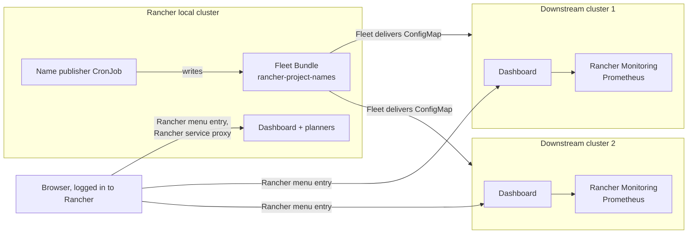

# Installation Guide

Step by step: installing the resource dashboard on every cluster, the allocation and capacity planners on the
Rancher local cluster, and Rancher Project names on the downstream clusters. For every value and permission see
the [chart README](../charts/cluster-resource-report/README.md); for using the planners see the
[allocation planner guide](allocation-planner.md).

## What gets installed where

One Helm chart, `charts/cluster-resource-report`, installed once per cluster with different values:

| Cluster | Role | What runs there |
|---|---|---|
| **Rancher local cluster** (the Rancher server's own cluster) | `local` | Dashboard of the local cluster, allocation planner and/or capacity planner (for all clusters), name publisher (CronJob writing one Fleet Bundle) |
| **Downstream clusters** (Rancher-managed, on-prem or AKS) | `downstream` | Dashboard of that cluster; reads Project names from a ConfigMap Fleet delivers |
| **Clusters outside Rancher** (e.g. standalone AKS) | `standalone` | Dashboard of that cluster; namespaces grouped by a label instead of Rancher Projects |



Nothing is exposed outside the cluster: you open the pages through Rancher's proxy with your Rancher login.
Everything is read-only against the clusters except the name publisher (one Fleet Bundle) and the planners
(their own plan ConfigMaps).

## Step 0. Check the prerequisites

On your workstation:

| Tool | Version | Check |
|---|---|---|
| `kubectl` | any recent | `kubectl version --client` |
| `helm` | 3.x | `helm version` |
| `git` | any | `git --version` |

Per cluster:

| Requirement | Needed for | Check | If missing |
|---|---|---|---|
| **metrics-server** | "now" usage snapshot (always) | `kubectl top pods -A \| head` | Included in k3s, RKE2 and AKS; otherwise install it |
| **Rancher Monitoring** (Prometheus, kube-state-metrics) | P95 usage and request peaks over 7 days | `kubectl -n cattle-monitoring-system get svc rancher-monitoring-prometheus` | Rancher UI → cluster → **Apps → Charts → Monitoring**; or install without history (step 3) |
| **Image pull** from `ghcr.io/cdalar/cluster-resource-report` or an internal mirror | the pods | — | Step 1 |

Rancher: tested with v2.15. The Rancher menu entries need Rancher's `NavLink` CRD, which every Rancher-managed
cluster has; on other clusters the chart skips them.

Work with a kubeconfig that has one context per cluster (download each from the Rancher UI: cluster →
**Download KubeConfig**), and check the context before every step:

```bash
kubectl config get-contexts
kubectl config use-context <cluster>
```

## Step 1. Get the chart and the image

```bash
git clone https://github.com/cdalar/cluster-resource-allocation.git
cd cluster-resource-allocation
git checkout v0.4.1        # a release tag; its image is ghcr.io/cdalar/cluster-resource-report:0.4.1
```

The chart's default image is `ghcr.io/cdalar/cluster-resource-report:<appVersion>`. Choose one:

**a) Pull from GHCR.** The image is public: clusters with internet access need nothing else.

**b) Mirror to an internal registry** (clusters without internet access, air-gapped):

```bash
crane copy ghcr.io/cdalar/cluster-resource-report:0.4.1 registry.example.com/platform/cluster-resource-report:0.4.1
```

and add to the values files below:

```yaml
image:
  repository: registry.example.com/platform/cluster-resource-report
  tag: "0.4.1"
```

## Step 2. Install on the Rancher local cluster

Create `values-local.yaml`:

```yaml
rancher:
  isLocalCluster: true        # read Rancher clusters, nodes and Project names from this cluster
  publishNames:
    enabled: true             # publish Project names to all downstream clusters (Fleet Bundle)
planner:
  enabled: true               # allocation planner (budgets, rates, costs)
capacityPlanner:
  enabled: false              # capacity planner (CPU / memory only, no money)
prometheus:
  enabled: false              # true if Rancher Monitoring runs on the local cluster
```

Enable one planner or both. Their plans are stored in ConfigMaps in the `resource-report` namespace, so no
volume or storage class is needed.

Install:

```bash
kubectl config use-context <rancher-local>
helm upgrade --install resource-report charts/cluster-resource-report \
  -n resource-report --create-namespace -f values-local.yaml
```

Check:

```bash
kubectl -n resource-report get pods,configmap,cronjob
# pod Running; ConfigMaps resource-report-cluster-resource-report-planner (and -capacity) for the plans;
# CronJob resource-report-cluster-resourc-publish-names (name shortened to 52 characters)
kubectl -n fleet-default get bundle rancher-project-names     # appears after the first CronJob run (≤ 10 min)
```

To publish without waiting for the schedule:

```bash
kubectl -n resource-report create job --from=cronjob/<cronjob-name> publish-now
```

In the Rancher UI, the Bundle is under **Continuous Delivery → Advanced → Bundles** (workspace `fleet-default`).

## Step 3. Install on each downstream cluster

Create `values-downstream.yaml`:

```yaml
rancher:
  namesConfigMap:
    enabled: true             # show Project names from the ConfigMap Fleet delivers (no token on the cluster)
prometheus:
  enabled: true               # Rancher Monitoring; set false on clusters without it
collection:
  window: 7d                  # usage history window; Rancher Monitoring keeps about 10 days
```

Install on each cluster, with the same release name and namespace as on the local cluster (the name publisher
delivers the ConfigMap to the namespace `resource-report` by default):

```bash
for ctx in onprem-prod-01 onprem-test-01 aks-prod; do
  kubectl config use-context "$ctx"
  helm upgrade --install resource-report charts/cluster-resource-report \
    -n resource-report --create-namespace -f values-downstream.yaml
done
```

Check on each cluster:

```bash
kubectl -n resource-report get pods
kubectl -n resource-report get configmap rancher-project-names     # delivered by Fleet
kubectl -n resource-report logs deploy/resource-report-cluster-resource-report | grep -i prometheus
# "prometheus has N days of data (window 7d)" = history is used
```

**Without Rancher Monitoring** the dashboard still works, with a metrics-server snapshot ("now") instead of P95
over the window. Install Rancher Monitoring later and set `prometheus.enabled: true` to get the history.

**Prometheus other than Rancher Monitoring:** set `prometheus.service` to `<namespace>/http:<service>:<port>`
(reached through the API server proxy), or `prometheus.url` plus `prometheus.tokenSecret` for a direct URL.
It must have the cAdvisor metrics and kube-state-metrics.

## Step 4. Clusters outside Rancher (optional)

For a cluster that Rancher doesn't manage (e.g. a standalone AKS), there are no Rancher Projects and no Fleet.
Label the namespaces with the project they belong to and group by that label:

```yaml
# values-standalone.yaml
collection:
  projectLabel: project       # namespaces with label project=<name>
prometheus:
  enabled: false              # or prometheus.service / prometheus.url, see step 3
```

```bash
helm upgrade --install resource-report charts/cluster-resource-report \
  -n resource-report --create-namespace -f values-standalone.yaml
```

There is no Rancher menu entry; open it with a port-forward (step 5). The planners only see clusters that
Rancher manages.

## Step 5. Open the pages

In the Rancher UI, open a cluster. Its left-hand menu has:

| Menu entry | Where | Opens |
|---|---|---|
| **Resource report** | every cluster | That cluster's dashboard |
| **Allocation planner** | local cluster, with `planner.enabled` | Budgets and quotas for all clusters |
| **Capacity planner** | local cluster, with `capacityPlanner.enabled` | CPU / memory envelopes for all clusters |

They open through Rancher's service proxy, so your Rancher login and permissions apply. The address is:

```
https://<rancher-host>/k8s/clusters/<cluster-id>/api/v1/namespaces/resource-report/services/http:resource-report-cluster-resource-report:80/proxy/
```

Without Rancher, or to test:

```bash
kubectl -n resource-report port-forward svc/resource-report-cluster-resource-report 8080:80
# http://localhost:8080/  (planners: /planner, /capacity)
```

The pages have no login of their own, so the chart never exposes them outside the cluster: the Service is
always ClusterIP and there is no Ingress option. Rancher's proxy (with your Rancher login) and port-forward are
the only ways in.

## Step 6. Verify

| What to check | Where | Expected |
|---|---|---|
| Collection ran | Dashboard header | A recent "collected" time; **Collect now** starts another |
| Project names | Dashboard project table | Names such as `payments`, not IDs such as `p-xxxxx` |
| Usage history | Dashboard columns | **CPU P95 / Mem P95** and "Used (P95)" (Prometheus) rather than **CPU now / Mem now** (snapshot only) |
| Enough history | Pod log: `prometheus has N days of data (window 7d)` | N reaches the window after that many days of Prometheus data |
| N+1 | Cluster summary | **Room for projects (N+1)** tile and dashed line in the capacity bar |
| Planner inventory | Planner, *Clusters* table | Every Rancher cluster with nodes, allocatable and largest node |
| Planner storage | Planner, **Save plan** | Saved without error; still there after `kubectl -n resource-report rollout restart deploy/resource-report-cluster-resource-report`; `binaryData` of the planner ConfigMap holds `plan.json.gz` |

## Upgrade

Check out the new release tag and run the same `helm upgrade --install` with the same values file:

```bash
git fetch --tags && git checkout v<new-version>
helm upgrade --install resource-report charts/cluster-resource-report -n resource-report -f values-downstream.yaml
```

Prefer the values file to `--reuse-values`: with `--reuse-values`, values added in a newer chart version are not
filled in from its defaults. With option b of step 1, mirror the new image and update `image.tag` first.

Saved plans are kept across upgrades (they're in ConfigMaps that Helm doesn't overwrite); older plans are
converted when loaded. Upgrading from 0.3.x to 0.4 or later, where plans were files on the PVC: keep `persistence.enabled: true`
for this upgrade, open each planner and click **Save plan** once. That moves the plan into its ConfigMap; after
that the PVC is no longer needed for the planners.

## Uninstall

```bash
helm uninstall resource-report -n resource-report
kubectl delete namespace resource-report
```

The plan ConfigMaps are kept (`helm.sh/resource-policy: keep`), so the plans survive `helm uninstall` and a
reinstall picks them up again. Deleting the namespace deletes them too; back them up first:

```bash
kubectl -n resource-report get configmap resource-report-cluster-resource-report-planner -o yaml > planner-backup.yaml
kubectl -n resource-report get configmap resource-report-cluster-resource-report-capacity -o yaml > capacity-backup.yaml
```

Uninstalling on the local cluster also removes the CronJob, but not the Fleet Bundle it wrote; delete it with
`kubectl -n fleet-default delete bundle rancher-project-names` (Fleet then removes the ConfigMap downstream).

## Troubleshooting

| Symptom | Cause | Fix |
|---|---|---|
| Pod `ImagePullBackOff` | The cluster can't reach `ghcr.io`, or the internal mirror lacks the tag | Mirror the image (step 1b) and set `image.repository` / `image.tag`; with an authenticated registry add `imagePullSecrets` |
| Project IDs (`p-xxxxx`) instead of names on a downstream dashboard | ConfigMap not there yet, or `rancher.namesConfigMap.enabled` not set | Check `kubectl -n resource-report get configmap rancher-project-names`; on the local cluster check the CronJob's last job and the Bundle's state; names appear after the next collection |
| ConfigMap delivered to the wrong namespace | Downstream release not in `resource-report` | Install in `resource-report`, or set `rancher.publishNames.targetNamespace` and `rancher.namesConfigMap.namespace` to match |
| Bundle shown as "Modified" in Continuous Delivery | Something changed the ConfigMap on the downstream cluster | Don't edit it by hand; the next publish restores it |
| "prometheus unavailable" in the log, columns show **CPU now / Mem now** | Rancher Monitoring not installed or under another name | Install it, or set `prometheus.service` / `prometheus.url`, or `prometheus.enabled: false` |
| Log shows "prometheus has 0.0 days of data" | Prometheus was just installed | Wait; P95 covers what exists so far. A shorter `collection.window` (e.g. `1d`) gives useful numbers sooner |
| Prometheus queries time out on a large cluster | 7 days at 5-minute steps is heavy | `collection.step: 15m` |
| No **Resource report** entry in the Rancher menu | Not a Rancher-managed cluster, or `rancher.navLink.enabled: false` | Use the port-forward; the NavLink is only created where the CRD exists |
| Chart fails: "ingress was removed" or "service.type was removed" | Values from an older release that exposed the dashboard | Remove `ingress.*` and `service.type` from your values; open the dashboard through Rancher |
| Chart fails: "publishNames.enabled needs rancher.isLocalCluster=true" | Name publisher enabled on a downstream cluster | Only enable it on the local cluster |
| Planner page missing (`/planner` 404) | `planner.enabled` not set | Set it, with `rancher.isLocalCluster: true` |
| Planner shows "can't read ConfigMap …" or "not saved: … forbidden" | Plan ConfigMap deleted by hand, or RBAC changed | `helm upgrade` again: it recreates the ConfigMap and the Role |
| Planner shows version 0 after upgrading from 0.3.x | Old plan file not on the volume any more (persistence was turned off before the first save) | Turn `persistence.enabled` on again for the upgrade (step "Upgrade") |
| Pod OOMKilled on a large cluster | Many thousands of pods | Raise `resources.limits.memory` |
| Dashboard empty after a pod restart | No persistence, first collection not finished | Wait for the collection, or set `persistence.enabled: true` (needs a storage class) |
