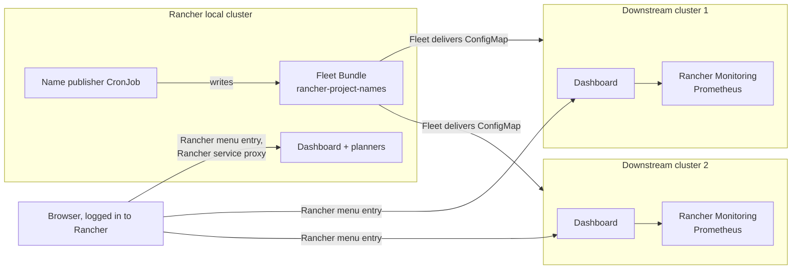

# Installation Guide

Step by step: installing the resource dashboard on every cluster, the allocation and capacity planners on the
Rancher local cluster, and Rancher Project names on the downstream clusters. For every value and permission see
the [chart README](../charts/cluster-resource-report/README.md); for using the planners see the
[allocation planner guide](allocation-planner.md).

## What gets installed where

One Helm chart, `cluster-resource-report`, installed once per cluster with different values:

| Cluster | Role | What runs there |
|---|---|---|
| **Rancher local cluster** (the Rancher server's own cluster) | `local` | Dashboard of the local cluster, allocation planner and/or capacity planner (for all clusters), name publisher (CronJob writing one Fleet Bundle) |
| **Downstream clusters** (Rancher-managed, on-prem or AKS) | `downstream` | Dashboard of that cluster; reads Project names from a ConfigMap Fleet delivers. Installed by hand, or by Fleet from the local cluster (Step 3, option A) |
| **Clusters outside Rancher** (e.g. standalone AKS) | `standalone` | Dashboard of that cluster; namespaces grouped by a label instead of Rancher Projects |



Nothing is exposed outside the cluster: you open the pages through Rancher's proxy with your Rancher login.
Everything is read-only against the clusters except the name publisher (one Fleet Bundle) and the planners
(their own plan ConfigMaps). With Step 3 option A, the local Helm release also creates one Fleet HelmOp that
installs the chart on the downstream clusters you choose.

## Step 0. Check the prerequisites

On your workstation:

| Tool | Version | Check |
|---|---|---|
| `kubectl` | any recent | `kubectl version --client` |
| `helm` | 3.8 or later (OCI charts) | `helm version` |

Per cluster:

| Requirement | Needed for | Check | If missing |
|---|---|---|---|
| **metrics-server** | "now" usage snapshot (always) | `kubectl top pods -A \| head` | Included in k3s, RKE2 and AKS; otherwise install it |
| **Rancher Monitoring** (Prometheus, kube-state-metrics) | P95 usage and request peaks over 7 days | `kubectl -n cattle-monitoring-system get svc rancher-monitoring-prometheus` | Rancher UI → cluster → **Apps → Charts → Monitoring**; or install without history (step 3) |
| **Access to `ghcr.io` or Docker Hub** (chart and image), or an internal mirror | installing, pulling the image | `helm show chart oci://ghcr.io/cdalar/charts/cluster-resource-report` | Step 1 (Docker Hub, or *Clusters without internet access*) |

Rancher: tested with v2.15. The Rancher menu entries need Rancher's `NavLink` CRD, which every Rancher-managed
cluster has; on other clusters the chart skips them.

Work with a kubeconfig that has one context per cluster (download each from the Rancher UI: cluster →
**Download KubeConfig**), and check the context before every step:

```bash
kubectl config get-contexts
kubectl config use-context <cluster>
```

## Step 1. Choose the chart version and image source

Every release is published on GHCR and copied to Docker Hub, public, with no login needed:

| | GHCR (default) | Docker Hub | Version |
|---|---|---|---|
| **Helm chart** (OCI) | `oci://ghcr.io/cdalar/charts/cluster-resource-report` | `oci://registry-1.docker.io/cdalar/cluster-resource-report-chart` | the release, e.g. `0.5.2` |
| **Image** | `ghcr.io/cdalar/cluster-resource-report` | `docker.io/cdalar/cluster-resource-report` | the same number (the chart's `appVersion`, used by default) |

Both locations hold the same artifacts. The chart's default image is the GHCR one. To use Docker Hub instead
(e.g. when your registry proxy only mirrors Docker Hub), set `CHART` to the Docker Hub location below and add
`image.repository: docker.io/cdalar/cluster-resource-report` to the values files.

Available versions: the [releases (tags)](https://github.com/cdalar/cluster-resource-allocation/tags) of the
repository, the chart's [GHCR package page](https://github.com/cdalar/cluster-resource-allocation/pkgs/container/charts%2Fcluster-resource-report)
or its [Docker Hub tags](https://hub.docker.com/r/cdalar/cluster-resource-report-chart/tags).

Docker Hub limits anonymous pulls per IP address; with many clusters behind one address, prefer GHCR or log in
to Docker Hub (`imagePullSecrets`).

Set the chart and version once in your shell; every command below uses them:

```bash
CHART=oci://ghcr.io/cdalar/charts/cluster-resource-report
# or: CHART=oci://registry-1.docker.io/cdalar/cluster-resource-report-chart
VERSION=0.5.2

helm show chart  $CHART --version $VERSION     # check that the chart can be pulled
helm show values $CHART --version $VERSION     # all values with their defaults
```

There is no `helm repo add`: OCI charts are installed straight from their `oci://` location.

### Clusters without internet access

Mirror both the chart and the image into your internal registry, then point `CHART` and the values at it:

```bash
helm pull $CHART --version $VERSION                                   # cluster-resource-report-0.5.2.tgz
helm push cluster-resource-report-$VERSION.tgz oci://registry.example.com/platform/charts
crane copy ghcr.io/cdalar/cluster-resource-report:$VERSION registry.example.com/platform/cluster-resource-report:$VERSION

CHART=oci://registry.example.com/platform/charts/cluster-resource-report
```

and add to every values file below:

```yaml
image:
  repository: registry.example.com/platform/cluster-resource-report
imagePullSecrets:            # only if the registry needs a login
  - name: registry-pull
```

The image tag defaults to the chart's `appVersion`, so it follows `VERSION` without being set.

### From source (optional)

For a development build: `git clone https://github.com/cdalar/cluster-resource-allocation.git`,
`git checkout v$VERSION` and `CHART=./charts/cluster-resource-report`; Helm ignores `--version` for a local path.

## Step 2. Install on the Rancher local cluster

Create `values-local.yaml`:

```yaml
rancher:
  isLocalCluster: auto        # the default: detects the Rancher local cluster (Rancher server in cattle-system)
                              # and reads clusters, nodes and Project names from it; true with helm template / Argo CD
  publishNames:
    enabled: true             # the default: publish Project names to all downstream clusters (Fleet Bundle)
planner:
  enabled: true               # the default: allocation planner (budgets, rates, costs)
capacityPlanner:
  enabled: true               # the default: capacity planner (CPU / memory only, no money)
prometheus:
  enabled: false              # true if Rancher Monitoring runs on the local cluster
```

Both planners are on by default; set one to `false` to leave it out. Their plans are stored in ConfigMaps in the `resource-report` namespace, so no
volume or storage class is needed.

Install:

```bash
kubectl config use-context <rancher-local>
helm upgrade --install resource-report $CHART --version $VERSION \
  -n resource-report --create-namespace -f values-local.yaml
```

Check:

```bash
kubectl -n resource-report get pods,configmap,cronjob
# pod Running; ConfigMaps resource-report-cluster-resource-report-planner (and -capacity) for the plans;
# CronJob resource-report-cluster-resourc-publish-names (name shortened to 52 characters)
kubectl -n fleet-default get bundle rancher-project-names     # appears after the first CronJob run (≤ 10 min)
```

To publish without waiting for the schedule:

```bash
kubectl -n resource-report create job --from=cronjob/<cronjob-name> publish-now
```

In the Rancher UI, the Bundle is under **Continuous Delivery → Advanced → Bundles** (workspace `fleet-default`).

## Step 3. Install on each downstream cluster

Two ways: **A.** let Fleet install it from the local cluster (one place to configure and upgrade), or **B.** install
it on each cluster yourself.

### Option A. With Fleet, from the local cluster

Needs Fleet ≥ 0.12 (Rancher 2.11+) and a chart version with `rancher.deployDownstream` (later than 0.5.2). The local
release renders one Fleet HelmOp (Rancher: **Continuous Delivery → App Bundles**) that installs the chart on the
clusters you choose, at the local release's chart version. It is on by default on the local cluster
(detected by `isLocalCluster: auto`), but installs nothing until you list clusters. Design and background:
[docs/08](../docs/08-fleet-deployment.md).

Add to `values-local.yaml` (Step 2):

```yaml
rancher:
  deployDownstream:                   # enabled: true is the default
    # The chart creates the Fleet ClusterGroup "resource-report" with these Rancher cluster names.
    # The default, change-me, matches no cluster: nothing is installed until you replace it.
    clusterGroup:
      clusterNames:
        - onprem-prod-01
        - onprem-test-01
    # More targets, optional:
    clusters:
      - name: aks-prod                # Fleet cluster name, with per-cluster values over the common ones below
        values:
          prometheus: {enabled: false}
    # clusterSelector: {matchLabels: {resource-report: enabled}}   # clusters labelled in Rancher
    values:                           # for every downstream release (what values-downstream.yaml holds in option B)
      collection:
        window: 7d
```

and run the Step 2 `helm upgrade --install` on the local cluster again. `clusterNames` are the names shown in
Rancher (label `management.cattle.io/cluster-display-name`); `clusters` takes the Fleet cluster names:

```bash
kubectl -n fleet-default get clusters.fleet.cattle.io --show-labels   # names and labels of the downstream clusters
kubectl -n fleet-default get clustergroups                            # the group and how many clusters it matches
kubectl -n fleet-default get helmops,bundles                          # the HelmOp and its Bundle: READY n/n
```

If a ClusterGroup `resource-report` was already created by hand, Helm refuses to take it over: delete it first,
or set `clusterGroup.create: false` to keep using it as it is.

What goes downstream: the local image repository, pull policy and pull secrets; `rancher.namesConfigMap.enabled`
when `publishNames` is on; then `deployDownstream.values` and the cluster's own `values`. Local-only settings
(`isLocalCluster`, `publishNames`, the planners) are always off downstream.

**Adding a cluster** to the group is an edit of `clusterGroup.clusterNames` and a `helm upgrade` on the local
cluster. To let a cluster opt in without a `helm upgrade`:
- *Label:* Cluster Management → cluster → ⋮ → **Edit Config** → Labels, e.g. `resource-report=enabled`, with
  `clusterSelector.matchLabels`.
- *Group kept in the Rancher UI:* set `clusterGroup.create: false` and edit the group under Continuous Delivery
  (workspace `fleet-default`) → **Cluster Groups** (a rule on `management.cattle.io/cluster-display-name` *in
  list*).

Removing a cluster from the targets makes Fleet uninstall the chart there.

**Group changes are not immediate.** Fleet re-matches a ClusterGroup only when a cluster changes, which normally
happens at the cluster agent's next check-in (up to about 15 minutes). To apply a change now, use **Force Update**
on the App Bundle: Continuous Delivery → App Bundles → `resource-report-cluster-resource-report` → ⋮ → **Force
Update** (it raises `spec.forceSyncGeneration`; tested: the chart was installed about 10 seconds later). With
kubectl: `kubectl -n fleet-default patch helmop resource-report-cluster-resource-report --type merge -p
'{"spec":{"forceSyncGeneration":<current + 1>}}'`, or touch the Fleet cluster with
`kubectl -n fleet-default annotate clusters.fleet.cattle.io <cluster> resource-report/resync="$(date +%s)" --overwrite`.

**Private registry or mirror:** set `deployDownstream.chart.repo` to the chart's full OCI URL and, with a login,
`deployDownstream.helmSecretName` (a secret with `username` / `password` in `fleet-default`).
`deployDownstream.insecureSkipTLSVerify: true` skips TLS verification for the chart download only; the image is
pulled by containerd on the nodes, which needs the registry's CA (or `insecure_skip_verify`) in its own
`registries.yaml`.

**Clusters already installed by hand (option B):** the HelmOp uses the same release name and namespace, and Fleet
takes the existing release over in place: it upgrades it as the next revision with the HelmOp's values (tested
on a 0.4.1 release). Nothing to uninstall first.

Check the downstream clusters as in option B below.

### Option B. By hand, on each cluster

Create `values-downstream.yaml`:

```yaml
rancher:
  namesConfigMap:
    enabled: true             # show Project names from the ConfigMap Fleet delivers (no token on the cluster)
prometheus:
  enabled: true               # Rancher Monitoring; set false on clusters without it
collection:
  window: 7d                  # usage history window; Rancher Monitoring keeps about 10 days
```

Install on each cluster, with the same release name and namespace as on the local cluster (the name publisher
delivers the ConfigMap to the namespace `resource-report` by default):

```bash
for ctx in onprem-prod-01 onprem-test-01 aks-prod; do
  kubectl config use-context "$ctx"
  helm upgrade --install resource-report $CHART --version $VERSION \
    -n resource-report --create-namespace -f values-downstream.yaml
done
```

Check on each cluster:

```bash
kubectl -n resource-report get pods
kubectl -n resource-report get configmap rancher-project-names     # delivered by Fleet
kubectl -n resource-report logs deploy/resource-report-cluster-resource-report | grep -i prometheus
# "prometheus has N days of data (window 7d)" = history is used
```

**Without Rancher Monitoring** the dashboard still works, with a metrics-server snapshot ("now") instead of P95
over the window. Install Rancher Monitoring later and set `prometheus.enabled: true` to get the history.

**Prometheus other than Rancher Monitoring:** set `prometheus.service` to `<namespace>/http:<service>:<port>`
(reached through the API server proxy), or `prometheus.url` plus `prometheus.tokenSecret` for a direct URL.
It must have the cAdvisor metrics and kube-state-metrics.

### Alternatively: install from the Rancher UI

Instead of `helm` on the command line, the chart can be installed as a Rancher app. Do this per cluster, since
Rancher repositories belong to one cluster:

1. Cluster → **Apps → Repositories → Create**: name `cluster-resource-report`, target **OCI repository**,
   URL `oci://ghcr.io/cdalar/charts/cluster-resource-report` (the chart's own location; the parent
   `oci://ghcr.io/cdalar/charts` can't be listed anonymously and fails with *403 Forbidden*), or from Docker Hub
   `oci://registry-1.docker.io/cdalar/cluster-resource-report-chart`. No authentication.
2. **Apps → Charts**, find **cluster-resource-report**, **Install**.
3. Namespace `resource-report`, name `resource-report` (the menu links and the name publisher expect these),
   version `0.5.2`.
4. In the YAML step, paste the content of `values-local.yaml` or `values-downstream.yaml`, then **Install**.

Upgrades then show up under **Apps → Installed Apps** when a new version is published (after the repository
refreshes, or **Refresh** on the repository).

## Step 4. Clusters outside Rancher (optional)

For a cluster that Rancher doesn't manage (e.g. a standalone AKS), there are no Rancher Projects and no Fleet.
Label the namespaces with the project they belong to and group by that label:

```yaml
# values-standalone.yaml
collection:
  projectLabel: project       # namespaces with label project=<name>
prometheus:
  enabled: false              # or prometheus.service / prometheus.url, see step 3
```

```bash
helm upgrade --install resource-report $CHART --version $VERSION \
  -n resource-report --create-namespace -f values-standalone.yaml
```

There is no Rancher menu entry; open it with a port-forward (step 5). The planners only see clusters that
Rancher manages.

## Step 5. Open the pages

In the Rancher UI, open a cluster. Its left-hand menu has:

| Menu entry | Where | Opens |
|---|---|---|
| **Resource report** | every cluster | That cluster's dashboard |
| **Allocation planner** | local cluster, with `planner.enabled` | Budgets and quotas for all clusters |
| **Capacity planner** | local cluster, with `capacityPlanner.enabled` | CPU / memory envelopes for all clusters |

They open through Rancher's service proxy, so your Rancher login and permissions apply. The address is:

```
https://<rancher-host>/k8s/clusters/<cluster-id>/api/v1/namespaces/resource-report/services/http:resource-report-cluster-resource-report:80/proxy/
```

Without Rancher, or to test:

```bash
kubectl -n resource-report port-forward svc/resource-report-cluster-resource-report 8080:80
# http://localhost:8080/  (planners: /planner, /capacity)
```

The pages have no login of their own, so the chart never exposes them outside the cluster: the Service is
always ClusterIP and there is no Ingress option. Rancher's proxy (with your Rancher login) and port-forward are
the only ways in.

## Step 6. Verify

| What to check | Where | Expected |
|---|---|---|
| Collection ran | Dashboard header | A recent "collected" time; **Collect now** starts another |
| Project names | Dashboard project table | Names such as `payments`, not IDs such as `p-xxxxx` |
| Usage history | Dashboard columns | **CPU P95 / Mem P95** and "Used (P95)" (Prometheus) rather than **CPU now / Mem now** (snapshot only) |
| Enough history | Pod log: `prometheus has N days of data (window 7d)` | N reaches the window after that many days of Prometheus data |
| N+1 | Cluster summary | **Room for projects (N+1)** tile and dashed line in the capacity bar |
| Planner inventory | Planner, *Clusters* table | Every Rancher cluster with nodes, allocatable and largest node |
| Planner storage | Planner, **Save plan** | Saved without error; still there after `kubectl -n resource-report rollout restart deploy/resource-report-cluster-resource-report`; `binaryData` of the planner ConfigMap holds `plan.json.gz` |

## Mark more namespaces as System

The dashboard puts every namespace in one of three categories: **Tenant** (in a Rancher Project),
**System** (Rancher's *System* project, or its name matches the system list) and **Unassigned** (neither).
Platform components that are in no Rancher Project show up as *Unassigned* unless their name is in the system
list. The list is `collection.systemNamespaceRegex` in the chart values; its default (below) includes the Rancher
and Kubernetes namespaces, `otel`, `monitoring`, storage providers (`rook-*`, `openebs*`, CSI drivers, `*provisioner*`) and **every name that contains `system`, `ingress` or `storage`**. To count
more namespaces as *System* without moving them in Rancher, add them to the list. This only changes the report;
nothing in Rancher or the cluster changes.

Setting the value **replaces** the default, so copy the whole value and add your namespaces before the closing
`)$`, separated by `|` (here `vault|team-infra-.*`, as an example). The expression must match the whole
namespace name; `.*` matches any rest.

```yaml
collection:
  systemNamespaceRegex: '^(kube-.*|cattle-.*|fleet-.*|rancher-.*|calico-.*|tigera-.*|kyverno|cert-manager|otel|monitoring|local|p-[a-z0-9]{5}|local-p-[a-z0-9]{5}|c-[a-z0-9-]+|u-[a-z0-9]+|user-[a-z0-9]+|rook-.*|openebs.*|csi-.*|.*-csi.*|.*provisioner.*|.*storage.*|.*system.*|.*ingress.*|vault|team-infra-.*)$'
```

The default, for reference (also in the chart's `values.yaml` and in `discover.py`):

```
^(kube-.*|cattle-.*|fleet-.*|rancher-.*|calico-.*|tigera-.*|kyverno|cert-manager|otel|monitoring|local|p-[a-z0-9]{5}|local-p-[a-z0-9]{5}|c-[a-z0-9-]+|u-[a-z0-9]+|user-[a-z0-9]+|rook-.*|openebs.*|csi-.*|.*-csi.*|.*provisioner.*|.*storage.*|.*system.*|.*ingress.*)$
```

**Whole projects**: every namespace of a Rancher Project whose name matches `collection.systemProjectRegex`
counts as *System* too. The default is Rancher's *System* project and any project with `platform` in its name
(ignoring case, e.g. `Platform`, `platform-services`); the planner hides those projects like *System*, since
they are in the platform reserve already. It needs the project names (step 2, name publisher); with only IDs
(`p-xxxxx`) the name can't match. To add names, e.g. a project `Infra`:

```yaml
collection:
  systemProjectRegex: '^(system|.*platform.*|infra)$'
```

A namespace match counts as *System* **even when the namespace is in a tenant Rancher Project**: it then drops out of that
project's totals and counts toward the platform reserve in the planner. Check that no tenant namespace contains
`system`, `ingress` or `storage` (e.g. `payments-ingress`, `photo-storage`): on the dashboard, tick only the *System* category and look for
namespaces that have a tenant project. If there are some, remove the keyword entries (`.*storage.*`, `.*system.*`,
`.*ingress.*`, …) and list the platform namespaces by name.

Apply it with the same `helm upgrade --install ... -f values-downstream.yaml` as in [Upgrade](#upgrade), or in
the Rancher UI under **Apps → Installed Apps → resource-report → Upgrade** (YAML, `collection` section). The
categories change with the next collection (every 30 minutes; **Collect now** on the dashboard runs one
immediately). Put the value in the values file of each cluster where you want it; the clusters don't share it.

## Upgrade

Run the same `helm upgrade --install` with the new version and the same values file, on the local cluster first
and then on the downstream clusters. With Step 3 option A, the local upgrade is all: Fleet upgrades the downstream
releases to the same version (check with `kubectl -n fleet-default get helmops,bundles`).

```bash
VERSION=<new-version>
helm upgrade --install resource-report $CHART --version $VERSION -n resource-report -f values-local.yaml       # local
helm upgrade --install resource-report $CHART --version $VERSION -n resource-report -f values-downstream.yaml  # each downstream
helm -n resource-report list                                     # CHART column shows cluster-resource-report-<new-version>
```

Prefer the values file to `--reuse-values`: with `--reuse-values`, values added in a newer chart version are not
filled in from their defaults. Without internet access, mirror the new chart and image first (step 1). Installed
from the Rancher UI: **Apps → Installed Apps → resource-report → Upgrade**.

Upgrading to 0.5: the dashboard classifies more namespaces as *System* by default (any name containing `system`,
`ingress` or `storage`, storage providers, `otel`, `monitoring`) and every namespace of a Rancher Project with
`platform` in its name; the planner's measured platform reserve grows accordingly and hides platform projects.
If you had set `collection.systemNamespaceRegex`, your value still replaces the default. See
[Mark more namespaces as System](#mark-more-namespaces-as-system).

Upgrading to 0.5.1: the planners get a what-if calculator for a new application (see the
[planner guide](allocation-planner.md#what-if-calculator-a-new-application)). Its Rancher licence price starts at
1,800 per node and year for existing plans too; set your own under *What-if* and save the plan.

Upgrading to 0.5.2: in the what-if calculator, CPU and memory are per replica (like a Deployment's `resources`),
and a *Single instance* option checks N+1 for applications that can't run as several replicas. The dashboard and
planners show the chart version and image tag under their title.

Saved plans are kept across upgrades (they're in ConfigMaps that Helm doesn't overwrite); older plans are
converted when loaded. Upgrading from 0.3.x to 0.4 or later, where plans were files on the PVC: keep
`persistence.enabled: true` for this upgrade, open each planner and click **Save plan** once. That moves the plan into its ConfigMap; after
that the PVC is no longer needed for the planners.

## Uninstall

```bash
helm uninstall resource-report -n resource-report
kubectl delete namespace resource-report
```

The plan ConfigMaps are kept (`helm.sh/resource-policy: keep`), so the plans survive `helm uninstall` and a
reinstall picks them up again. Deleting the namespace deletes them too; back them up first:

```bash
kubectl -n resource-report get configmap resource-report-cluster-resource-report-planner -o yaml > planner-backup.yaml
kubectl -n resource-report get configmap resource-report-cluster-resource-report-capacity -o yaml > capacity-backup.yaml
```

With Step 3 option A, **uninstalling on the local cluster also uninstalls the chart on every downstream cluster**
(the HelmOp is deleted and Fleet removes its releases); so does turning `rancher.deployDownstream.enabled` off.
If the downstream dashboards should stay, install them by hand afterwards (option B).

Uninstalling on the local cluster also removes the CronJob, but not the Fleet Bundle it wrote; delete it with
`kubectl -n fleet-default delete bundle rancher-project-names` (Fleet then removes the ConfigMap downstream).

## Troubleshooting

| Symptom | Cause | Fix |
|---|---|---|
| `helm` fails: "failed to do request … ghcr.io" | No access to `ghcr.io` from where you run `helm` | Mirror the chart (step 1) and set `CHART` to the mirror |
| `helm` fails: "… not found" for the version | `VERSION` isn't a published release, or has a leading `v` | Use the number without `v` (e.g. `0.5.2`); see the package page (step 1) |
| Pod `ImagePullBackOff` | The cluster can't reach `ghcr.io`, or the mirror lacks the tag | Mirror the image (step 1) and set `image.repository`; with an authenticated registry add `imagePullSecrets` |
| Rancher repository shows *403 Forbidden* | URL is `oci://ghcr.io/cdalar/charts` | Use the chart's own location `oci://ghcr.io/cdalar/charts/cluster-resource-report` |
| Pulls from Docker Hub fail with *429 Too Many Requests* | Docker Hub's anonymous pull limit | Use GHCR (the default), or add a Docker Hub login as `imagePullSecrets` |
| Project IDs (`p-xxxxx`) instead of names on a downstream dashboard | ConfigMap not there yet, or `rancher.namesConfigMap.enabled` not set | Check `kubectl -n resource-report get configmap rancher-project-names`; on the local cluster check the CronJob's last job and the Bundle's state; names appear after the next collection |
| ConfigMap delivered to the wrong namespace | Downstream release not in `resource-report` | Install in `resource-report`, or set `rancher.publishNames.targetNamespace` and `rancher.namesConfigMap.namespace` to match |
| Bundle shown as "Modified" in Continuous Delivery | Something changed the ConfigMap on the downstream cluster | Don't edit it by hand; the next publish restores it |
| "prometheus unavailable" in the log, columns show **CPU now / Mem now** | Rancher Monitoring not installed or under another name | Install it, or set `prometheus.service` / `prometheus.url`, or `prometheus.enabled: false` |
| Log shows "prometheus has 0.0 days of data" | Prometheus was just installed | Wait; P95 covers what exists so far. A shorter `collection.window` (e.g. `1d`) gives useful numbers sooner |
| Prometheus queries time out on a large cluster | 7 days at 5-minute steps is heavy | `collection.step: 15m` |
| No **Resource report** entry in the Rancher menu | Not a Rancher-managed cluster, or `rancher.navLink.enabled: false` | Use the port-forward; the NavLink is only created where the CRD exists |
| Chart fails: "ingress was removed" or "service.type was removed" | Values from an older release that exposed the dashboard | Remove `ingress.*` and `service.type` from your values; open the dashboard through Rancher |
| Chart fails: "rancher.deployDownstream: set clusters, clusterSelector or clusterGroup" | Fleet deployment enabled without a target | Name the clusters, or set a selector or group; `clusterSelector: {}` = every cluster in the workspace |
| Chart fails: "rancher.deployDownstream needs Fleet HelmOps" | Fleet older than 0.12, or not the Rancher local cluster | Upgrade Rancher (2.11+), or install downstream by hand (option B) |
| Cluster added to or removed from the ClusterGroup, nothing happens | Fleet re-matches groups only when a cluster changes (agent check-in, up to ~15 min) | Wait, or **Force Update** the App Bundle in Continuous Delivery (see Step 3, option A) |
| App Bundle not *Accepted* / Bundle not ready | Chart not reachable from the Fleet controller, wrong `chart.repo`, or TLS / login to a mirror | `kubectl -n fleet-default describe helmop resource-report-cluster-resource-report`; check `chart.repo` (full OCI URL of the chart), `helmSecretName`, `insecureSkipTLSVerify` |
| Planner page missing (`/planner` 404) on the local cluster | Local cluster not detected (installed with `helm template` / Argo CD, or `isLocalCluster: false`), or `planner.enabled: false` | Set `rancher.isLocalCluster: true` (the planners only run with the Rancher inventory) |
| Planner shows "can't read ConfigMap …" or "not saved: … forbidden" | Plan ConfigMap deleted by hand, or RBAC changed | `helm upgrade` again: it recreates the ConfigMap and the Role |
| Planner shows version 0 after upgrading from 0.3.x | Old plan file not on the volume any more (persistence was turned off before the first save) | Turn `persistence.enabled` on again for the upgrade (step "Upgrade") |
| Pod OOMKilled on a large cluster | Many thousands of pods | Raise `resources.limits.memory` |
| Dashboard empty after a pod restart | No persistence, first collection not finished | Wait for the collection, or set `persistence.enabled: true` (needs a storage class) |
